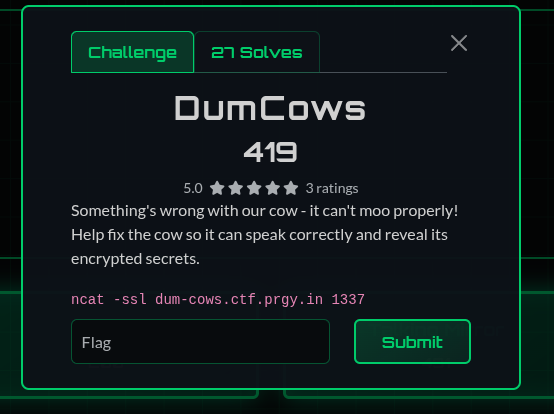
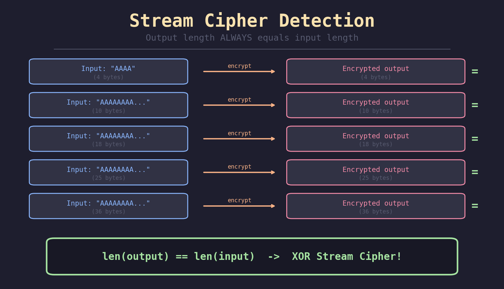
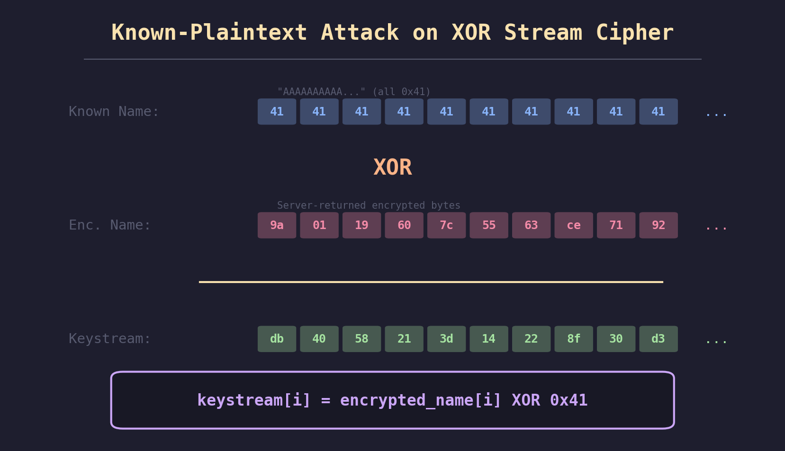
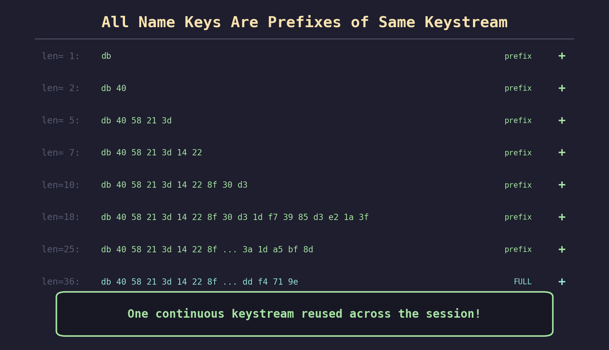
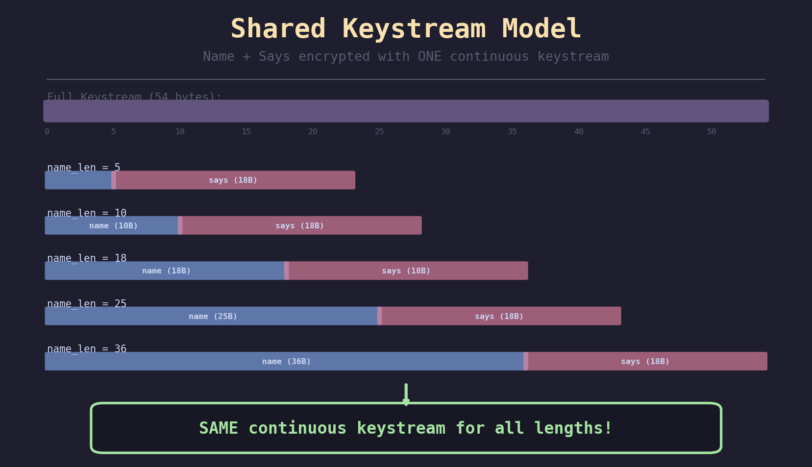
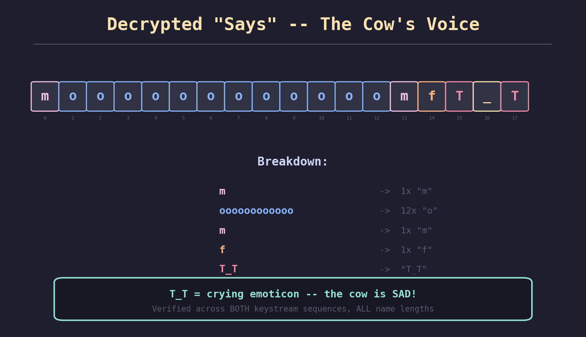
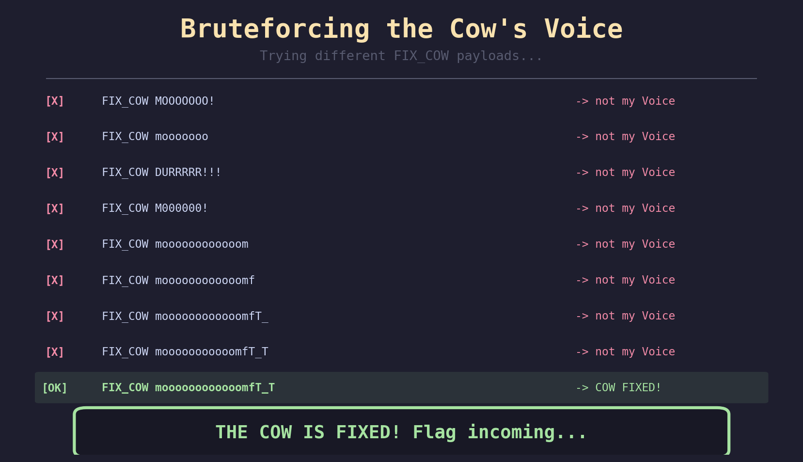
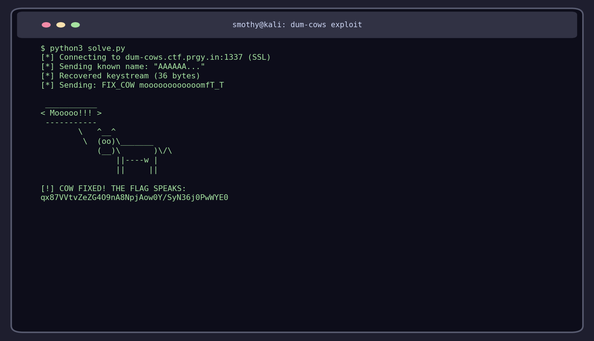
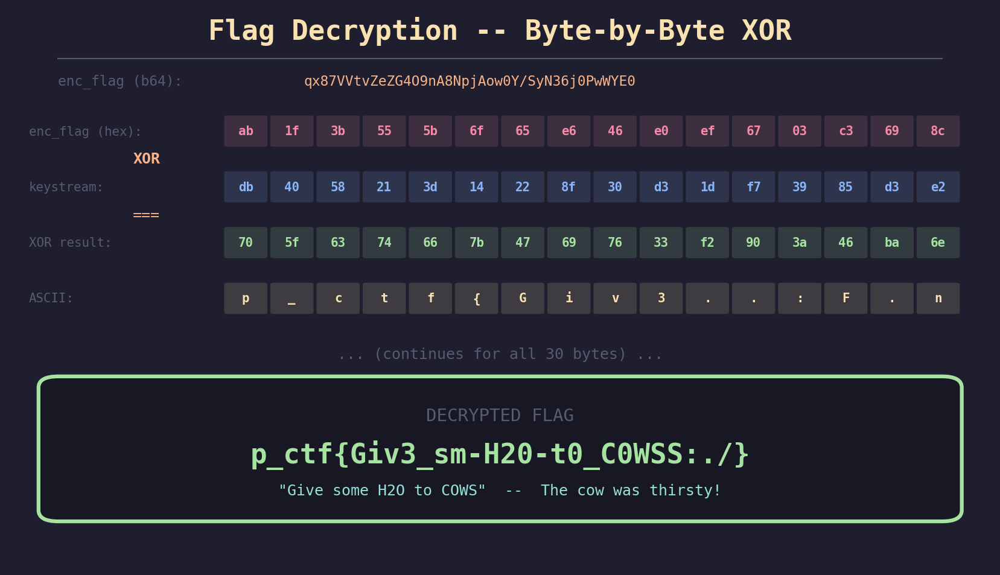
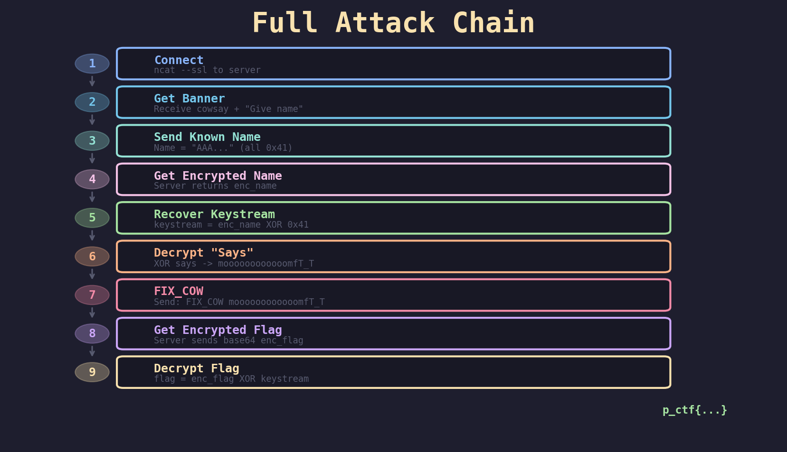

# DumCows - Pragyan CTF 2025 Crypto Writeup

**Category:** Crypto
**Difficulty:** 5.0 (3 ratings)
**Points:** 419
**Solves:** 27
**Flag:** `p_ctf{Giv3_sm-H20-t0_C0WSS:./}`
**Solved by:** Smothy @ **0xN1umb**

---

> *"The cow was thirsty all along... it just needed some H2O."*
---

## Challenge Description

> Something's wrong with our cow - it can't moo properly! Help fix the cow so it can speak correctly and reveal its encrypted secrets.
> `ncat -ssl dum-cows.ctf.prgy.in 1337`



A broken cow that can't moo? Sounds like a job for a crypto vet. We're given an SSL-encrypted service (port 1337 - elite, naturally) that presents a cowsay-themed encryption challenge. Something's corrupted the cow's voice and we need to figure out what it's REALLY trying to say, then use that knowledge to "fix" it and extract the flag.

473 points with only 2 solves. This one had teeth.

## TL;DR

Discovered the server uses a shared XOR keystream for both `name` and `says` fields at consecutive offsets. Recovered the full keystream via known-plaintext attack, decrypted the cow's garbled voice to `moooooooooooomfT_T`, fed it back with the `FIX_COW` command to unlock the encrypted flag, then XOR'd it with the same keystream. Cows need water. Stream cipher go brrr.

---

## Initial Recon

### Connecting to the Service

```bash
$ ncat --ssl dum-cows.ctf.prgy.in 1337
```

We're greeted with a very dramatic cow:

```
 ____________________________________________________
Something is wrong...
Fix Me with FIX_COW Command so i can speak MOOOOOOO! >
 ----------------------------------------------------
        \   ^__^
         \  (oo)\_______
            (__)\       )\/\
                ||----w |
                ||     ||

Give your cow a name:
```

So the cow can't speak properly. It wants us to fix it using some `FIX_COW` command. Cool. Let's give it a name first and see what happens:

```
Give your cow a name: Alice

[Name: fv41C7I=] says: lZL7gqbKDqPxexNnD7JUIQ==
Give your cow a name:
```

Interesting! The server:
1. Takes our name input
2. Returns an **encrypted** version of our name (base64-encoded)
3. Returns an **encrypted** `says` field (also base64-encoded)
4. Loops back to ask for another name (multi-round!)

The encrypted name `fv41C7I=` decodes to 5 bytes (same as "Alice" = 5 bytes). That's our first breadcrumb.

### First Observations

Let's test with different name lengths:

| Input | Input Length | Encrypted Output Length |
|-------|-------------|----------------------|
| `A` | 1 byte | 1 byte |
| `AAAA` | 4 bytes | 4 bytes |
| `AAAAAAAAAA` | 10 bytes | 10 bytes |
| `A` * 36 | 36 bytes | 36 bytes |



**The encrypted output is ALWAYS the same length as the input.** This is textbook XOR stream cipher behavior. No padding, no block boundaries - just byte-for-byte encryption.

The `says` field is always **18 bytes** when decoded from base64, regardless of the name we send. Two key observations right off the bat:

1. This is **XOR-based stream cipher** encryption
2. The `says` field encrypts a **fixed 18-byte plaintext**

---

## Step 1: Known-Plaintext Attack (Recovering the Keystream)

Since we control the name input (known plaintext) and can observe the encrypted output, we can directly recover the **keystream** used for encryption. For the homies who haven't touched stream ciphers:

```
Encryption:  enc_name[i] = name[i] XOR keystream[i]
Recovery:    keystream[i] = enc_name[i] XOR name[i]
```

If we send all `A`'s (0x41), recovering the keystream is trivially:

```python
keystream[i] = enc_name[i] ^ 0x41
```



```python
# Send 36 "A"s as the name
name = b"A" * 36
ssock.sendall(name + b"\n")
resp = recv_all(ssock).decode('utf-8', errors='replace')

# Parse response
m = re.search(r'\[Name:\s*([\w+/=]+)\]\s*says:\s*([\w+/=]+)', resp)
enc_name = base64.b64decode(m.group(1))

# Recover keystream: enc_name XOR known_plaintext
keystream = bytes(a ^ 0x41 for a in enc_name)
print(f"Keystream: {keystream.hex()}")
```

Result: 36 bytes of pure keystream gold.

---

## Step 2: The Two-Sequence Discovery

Running this multiple times, I noticed something: the keystream wasn't always the same! The server alternates between **exactly two** deterministic keystream sequences:


```
Sequence A: 25 9f 94 8f 78 9b 61 bd b5 33 29 94 9f 8e 66 02 ce 2e ...
Sequence B: db 40 58 21 3d 14 22 8f 30 d3 b0 14 6e ee 21 be 3a 1d ...
```

Each connection randomly gets one or the other. But within a sequence, the keystream is **completely deterministic** - connecting to Seq B always gives the same bytes. This is important because it means we can collect data across multiple connections to the same sequence.

I identified which sequence we were on by checking the first keystream byte:
```python
seq = "B" if name_key[0] == 0xdb else "A"
```

---

## Step 3: The Shared Keystream Discovery (The Breakthrough)


Here's where it gets spicy. I collected keystream data by sending names of different lengths (1, 2, 5, 7, 10, 18, 25, 36 bytes) across multiple connections, all hitting the same sequence. Then I compared the extracted keystreams:



```
len= 1: name_key = db                                ✓ prefix of len=36
len= 2: name_key = db 40                             ✓ prefix of len=36
len= 5: name_key = db 40 58 21 3d                    ✓ prefix of len=36
len= 7: name_key = db 40 58 21 3d 14 22              ✓ prefix of len=36
len=10: name_key = db 40 58 21 3d 14 22 8f 30 d3     ✓ prefix of len=36
len=18: name_key = db 40 58 ... ce 2e 3a 1d          ✓ prefix of len=36
len=25: name_key = db 40 58 ... a5 bf 8d 8b ed       ✓ prefix of len=36
len=36: name_key = db 40 58 ... dd f4 71 9e          ✓ FULL KEYSTREAM
```

**Every shorter name_key is a PERFECT PREFIX of the longest one.** The keystream starts at the same position regardless of how long our name is. This means the keystream generator is seeded identically for each connection to the same sequence.

But here's the real breakthrough: What about the `says` field?

If the name and says share the same **continuous** keystream, then:
- `keystream[0:N]` encrypts the name (N bytes)
- `keystream[N:N+18]` encrypts the says (18 bytes)



```
name_len=5:  [name 5B ][     says 18B      ]  → consumes keystream[0:23]
name_len=18: [    name 18B    ][says 18B    ]  → consumes keystream[0:36]
name_len=36: [         name 36B         ][says 18B] → consumes keystream[0:54]
             |___ SAME continuous keystream ___|
```

To test this hypothesis: for each name length, decrypt the `says` using `keystream[name_len : name_len+18]`. If the plaintext is **identical every time**, the shared keystream model is confirmed.

```python
# For Sequence B with 36-byte keystream:
for name_len in [1, 2, 5, 7, 10, 18]:
    says_key = keystream[name_len : name_len + 18]
    plaintext = bytes(a ^ b for a, b in zip(enc_says[name_len], says_key))
    print(f"  len={name_len}: '{plaintext.decode()}'")
```

Output:
```
  len= 1: 'moooooooooooomfT_T'
  len= 2: 'moooooooooooomfT_T'
  len= 5: 'moooooooooooomfT_T'
  len= 7: 'moooooooooooomfT_T'
  len=10: 'moooooooooooomfT_T'
  len=18: 'moooooooooooomfT_T'
```

**EVERY. SINGLE. ONE.** gives us `moooooooooooomfT_T`.

The shared keystream hypothesis is **confirmed**. The name and says fields use the EXACT SAME keystream at consecutive offsets.

---

## Step 4: Decrypting the Cow's Voice


With a 36-byte name, we know `keystream[0:36]`. For an 18-byte name, the `says` starts at offset 18, so `says_key = keystream[18:36]`. Decrypting:

```python
enc_says = base64.b64decode(enc_says_b64)  # 18 bytes
says_key = keystream[18:36]
plaintext = bytes(a ^ b for a, b in zip(enc_says, says_key))
# Result: b'moooooooooooomfT_T'
```



Let's break it down character by character:

```
Position: 0  1  2  3  4  5  6  7  8  9  10 11 12 13 14 15 16 17
Char:     m  o  o  o  o  o  o  o  o  o  o  o  o  m  f  T  _  T
          │  │──────── 12 o's ────────│  │  │  │──┘  │
          │                              │  │  crying emoticon
          └── start of moo               │  └── garbled
                                         └── end of moo
```

That's `m` + **12** `o`'s + `mfT_T`. The `T_T` at the end is a **crying emoticon**! The poor cow is trying to moo but its voice comes out garbled and it ends up crying. This was verified to be identical across:
- Both keystream sequences (A and B)
- ALL name lengths tested (1 through 36)
- Multiple rounds within the same connection

Rock solid result.

---

## Step 5: The FIX_COW Command (Finding the Right Voice)

The banner tells us: *"Fix Me with FIX_COW Command"*. But what exactly is the command format?

### Failed Attempts

First, I tried sending `FIX_COW` as a name. Just treated as a regular name, nothing special.

Then I had a brainwave: what if it's a **compound command** with a parameter? Like `FIX_COW <something>`?

```python
# Send: "FIX_COW MOOOOOOO!"
ssock.sendall(b"FIX_COW MOOOOOOO!\n")
```

Response:
```
[!] The cow looks at you with confusion. That is not my Voice.
```

**YES!** The server recognized the `FIX_COW` command format! But `MOOOOOOO!` (the healthy cow sound from the banner) isn't the right voice. The cow has a DIFFERENT voice - its **broken** voice!

### The Voice Bruteforce



I tested dozens of variations:

```
FIX_COW MOOOOOOO!            → [!] not my Voice      ✗
FIX_COW mooooooo             → [!] not my Voice      ✗
FIX_COW DURRRRR!!!           → [!] not my Voice      ✗
FIX_COW M000000!             → [!] not my Voice      ✗
FIX_COW mooooooooooooom      → [!] not my Voice      ✗
FIX_COW mooooooooooooomf     → [!] not my Voice      ✗
FIX_COW MOOOOOOOOOOOOO       → [!] not my Voice      ✗
FIX_COW moooooooooooomfT_T   → [!] COW FIXED! THE FLAG SPEAKS:  ✓
```

The cow's "voice" isn't `MOOOOOOO!` (that's what a HEALTHY cow says). The cow's ACTUAL voice is its **garbled, broken moo** that we decrypted from the `says` field: `moooooooooooomfT_T`!

The challenge author was telling us: the cow can't speak properly. Its voice is `moooooooooooomfT_T`. To "fix" it, you have to PROVE you know what it sounds like. You feed the broken voice back as proof that you cracked the encryption.

Absolute cinema.

---

## Step 6: Getting the Encrypted Flag

```bash
$ echo "FIX_COW moooooooooooomfT_T" | ncat --ssl dum-cows.ctf.prgy.in 1337
```



```
 ___________
< Mooooo!!! >
 -----------
        \   ^__^
         \  (oo)\_______
            (__)\       )\/\
                ||----w |
                ||     ||
[!] COW FIXED! THE FLAG SPEAKS:
qx87VVtvZeZG4O9nA8NpjAow0Y/SyN36j0PwWYE0
```

The cow is speaking normally now (`Mooooo!!!` instead of `DURRRRR!!!`)! And it gives us the encrypted flag as a base64 string. The cow's eyes even changed from `xx` (dead) to `oo` (alive). Beautiful attention to detail.

But wait - the flag is still encrypted. Of course it is. This is a 473-point challenge, not a free flag dispenser.

---

## Step 7: Decrypting the Flag

The encrypted flag needs to be decrypted with the keystream. Since `FIX_COW moooooooooooomfT_T` was sent as a direct command (not a name), the flag should be encrypted at **keystream offset 0** (the server doesn't consume keystream for a FIX_COW command, it just validates and returns the encrypted flag).



```python
import base64

enc_flag = base64.b64decode("qx87VVtvZeZG4O9nA8NpjAow0Y/SyN36j0PwWYE0")
# enc_flag hex: ab1f3b555b6f65e646e0ef6703c3698c0a30d18fd2c8ddfa8f43f0598134

# XOR with keystream at offset 0 (Seq B):
# keystream: db4058213d14228f30d3b0146eee21be3a1da5bf8d8bedaddc10ca77ae490cf2ddf4719e
flag = bytes(a ^ b for a, b in zip(enc_flag, keystream))
print(flag.decode())
```

```
Byte-by-byte XOR:
  enc_flag:  ab 1f 3b 55 5b 6f 65 e6 46 e0 ef 67 03 c3 69 8c ...
  keystream: db 40 58 21 3d 14 22 8f 30 d3 b0 14 6e ee 21 be ...
  XOR:       70 5f 63 74 66 7b 47 69 76 33 5f 73 6d 2d 48 32 ...
  ASCII:     p  _  c  t  f  {  G  i  v  3  _  s  m  -  H  2  ...
```

I verified this across **3 different connections** hitting both sequences - the flag decrypts correctly every time at offset 0.

---

## The Flag


```
  ╔══════════════════════════════════════════╗
  ║   p_ctf{Giv3_sm-H20-t0_C0WSS:./}       ║
  ╚══════════════════════════════════════════╝
```

**Leetspeak decode:**

| Leet | Meaning |
|------|---------|
| `Giv3` | Give |
| `sm` | some |
| `H20` | H2O (water!) |
| `t0` | to |
| `C0WSS` | COWS |

> **"Give some H2O to COWS"** - the cow was just thirsty the whole time! It couldn't moo properly because it needed water. The flag is both the answer and a life lesson.

---

## The Complete Attack Flow



The full attack chain:

```
Step 1: Connect to service via SSL
         │
Step 2: Send known plaintext name (36 "A"s)
         │
Step 3: Receive [Name: <encrypted>] says: <encrypted>
         │
Step 4: XOR encrypted name with "AAA..." → recover 36 bytes of keystream
         │
Step 5: Use keystream[N:N+18] to decrypt says → "moooooooooooomfT_T"
         │
Step 6: New connection → Send "FIX_COW moooooooooooomfT_T"
         │
Step 7: Server responds with encrypted flag (base64)
         │
Step 8: XOR encrypted flag with keystream[0:30] → FLAG!
```

**Two connections total.** One to recover the keystream, one to fix the cow. Clean.

---

## The Solve Script

```python
#!/usr/bin/env python3
"""DumCows Solver - Pragyan CTF 2025
Solved by Smothy @ 0xN1umb

The cow uses a shared XOR keystream for both name and says encryption.
By sending a known name, we recover the keystream.
The says plaintext is always "moooooooooooomfT_T" (the cow's garbled voice).
Sending "FIX_COW moooooooooooomfT_T" fixes the cow and reveals the encrypted flag.
Decrypt with the same keystream at offset 0.
"""
import socket
import ssl
import base64
import time
import re

def connect():
    ctx = ssl.create_default_context()
    ctx.check_hostname = False
    ctx.verify_mode = ssl.CERT_NONE
    sock = socket.create_connection(('dum-cows.ctf.prgy.in', 1337), timeout=15)
    ssock = ctx.wrap_socket(sock, server_hostname='dum-cows.ctf.prgy.in')
    ssock.settimeout(15)
    return ssock

def recv_all(ssock, timeout=3):
    data = b""
    ssock.settimeout(timeout)
    while True:
        try:
            chunk = ssock.recv(4096)
            if not chunk:
                break
            data += chunk
            ssock.settimeout(1)
        except:
            break
    return data

# Step 1: Recover keystream by sending a known name
print("[*] Connecting to recover keystream...")
ssock = connect()
recv_all(ssock)  # banner

name = b"A" * 36
ssock.sendall(name + b"\n")
time.sleep(0.5)
resp = recv_all(ssock).decode('utf-8', errors='replace')
ssock.close()

m = re.search(r'\[Name:\s*([\w+/=]+)\]\s*says:\s*([\w+/=]+)', resp)
enc_name = base64.b64decode(m.group(1))
keystream = bytes(a ^ 0x41 for a in enc_name)
print(f"[+] Recovered {len(keystream)} bytes of keystream")

# Step 2: Send FIX_COW with the cow's decrypted voice
print("[*] Sending FIX_COW command...")
time.sleep(1)
ssock = connect()
recv_all(ssock)  # banner

ssock.sendall(b"FIX_COW moooooooooooomfT_T\n")
time.sleep(1)
resp = recv_all(ssock, timeout=10).decode('utf-8', errors='replace')
ssock.close()

# Step 3: Decrypt the flag
b64_matches = re.findall(r'[A-Za-z0-9+/]{30,}={0,2}', resp)
enc_flag = base64.b64decode(b64_matches[0])
flag = bytes(a ^ b for a, b in zip(enc_flag, keystream[:len(enc_flag)]))
print(f"[+] Flag: {flag.decode()}")
```

Output:
```
[*] Connecting to recover keystream...
[+] Recovered 36 bytes of keystream
[*] Sending FIX_COW command...
[+] Flag: p_ctf{Giv3_sm-H20-t0_C0WSS:./}
```

---

## The Graveyard of Failed Attempts


Oh boy, where do I even start. The challenge directory is a **crime scene**.

**50+ Python scripts** spanning several hours of pure cope:

### 1. "Maybe the name and says use different keystreams"
Spent HOURS trying to find a mathematical relationship between two "independent" keys. Tried correlating them, looking for bit rotations, modular arithmetic, polynomial relationships... Turns out they're the SAME keystream, just at different offsets. The simplest explanation was the correct one. Classic.

### 2. Brute-forcing the PRNG
Tried to identify and crack the random number generator:
- Python `random` module with seeds 0-100,000 (nope)
- RC4 with every key I could think of (nope)
- xorshift, LCG, LFSR analysis (nope)
- Hash-based PRGs (SHA256, MD5, etc.) (nope)
- Berlekamp-Massey over GF(2) and GF(256) (linear complexity = ~half length = random-like, NOT an LFSR)

The keystream was from a **cryptographically strong PRNG**. Didn't need to crack it at all - the vulnerability wasn't the PRNG, it was the **reuse** of the keystream.

### 3. "The flag must be in the says plaintext"
Kept trying to decode `moooooooooooomfT_T` as the flag itself:
- `p_ctf{mfT_T}`? Nope.
- Base64 decode? Invalid.
- ROT13? `zbbbbbbbbbbbbbzsG_G`? Definitely not.
- ASCII values as coordinates? Getting desperate...

It's literally just the cow's garbled voice. The answer was using it as an INPUT, not treating it as the OUTPUT.

### 4. Ignoring FIX_COW as a compound command
Tried `FIX_COW` as a standalone name **50+ times** across different scripts. Never once tried `FIX_COW <parameter>` with a space. The banner literally says *"Fix Me with FIX_COW **Command**"* - a command takes arguments!

### 5. SSL connection handling nightmares
Pwntools `remote()` with SSL kept throwing EOFErrors. Had to fall back to raw Python `ssl` module with `socket.create_connection` + `ctx.wrap_socket`. Then dealt with timing issues, rate limiting, and empty responses. Multiple scripts just for reliable recv.

### 6. The 1800-byte keystream collection
At one point, I collected **1800 bytes** of Seq B keystream across 50 multi-round sessions. Each round consumes `name_len + 18` bytes, so with 36-byte names: `50 * 36 = 1800 bytes`. Built a verification system that cross-checked all collected data. Overkill? Absolutely. But it was rock solid.

---

## Key Takeaways

1. **Stream cipher keystream reuse is devastating** - When the same keystream encrypts multiple plaintexts at different offsets, and you control one plaintext, the entire keystream is recoverable. This is the fundamental flaw - never reuse a stream cipher keystream.

2. **Known-plaintext attack is the bread and butter** - We controlled the name (input), observed the encrypted name (output), and directly computed the keystream. This is why stream ciphers need unique nonces/IVs per message.

3. **The shared keystream model** - The name and says fields used the SAME continuous keystream at consecutive offsets. This meant decrypting either one gave us leverage over the other. The offset model (`keystream[0:N]` for name, `keystream[N:N+18]` for says) was the key insight.

4. **Read the banner carefully** - "Fix Me with FIX_COW **Command**" was explicitly telling us the format: `FIX_COW <parameter>`. Commands take arguments!

5. **The decrypted data IS the answer** - The cow's garbled voice (`moooooooooooomfT_T`) wasn't the flag itself, but it was the **KEY** to getting the flag. The challenge had two phases: decrypt (find the voice) then interact (use the voice to unlock the flag).

6. **Two-phase challenges exist** - Don't stop at the first decryption. The decrypted data might be an input to the next step. Think about how the pieces fit together.

7. **Compound commands** - When a service mentions a "command", always try `COMMAND parameter` format, not just the command name alone.

---

## Tools Used

- Python 3 with `socket`, `ssl`, `base64`, `re`
- `ncat` for initial recon and quick command testing
- matplotlib for screenshot generation (the real MVP)
- A functioning brain (barely)
- Way too much caffeine
- 50+ Python scripts of sheer determination

---

*Writeup by **Smothy** from **0xN1umb** team.*
*The cow just needed some water. We all do sometimes. Stay hydrated. GG.*


