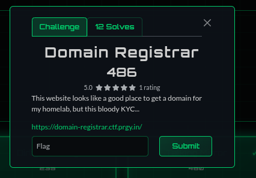
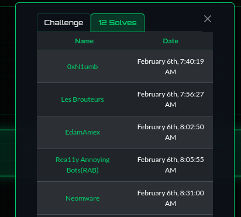
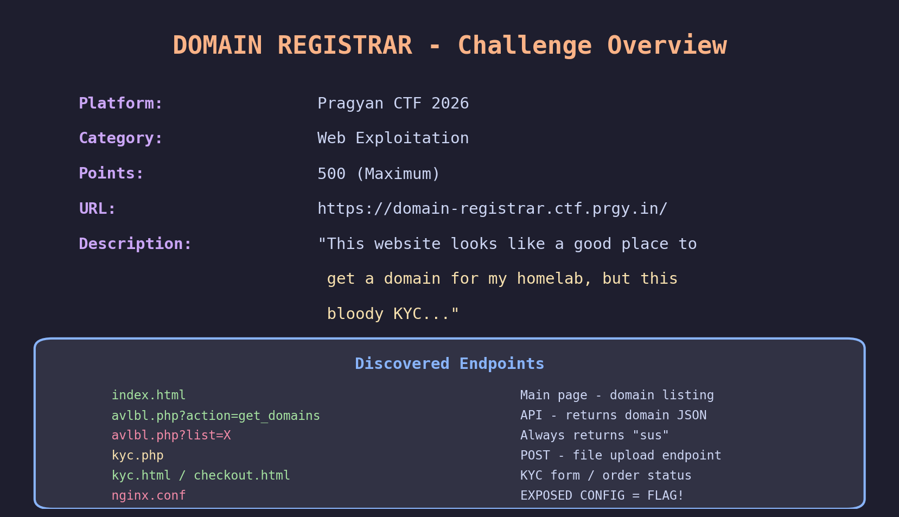
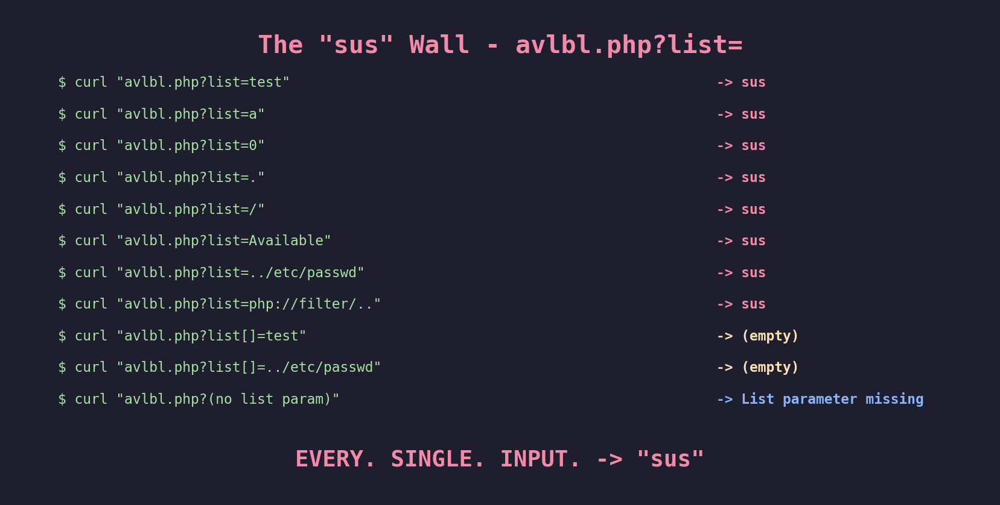
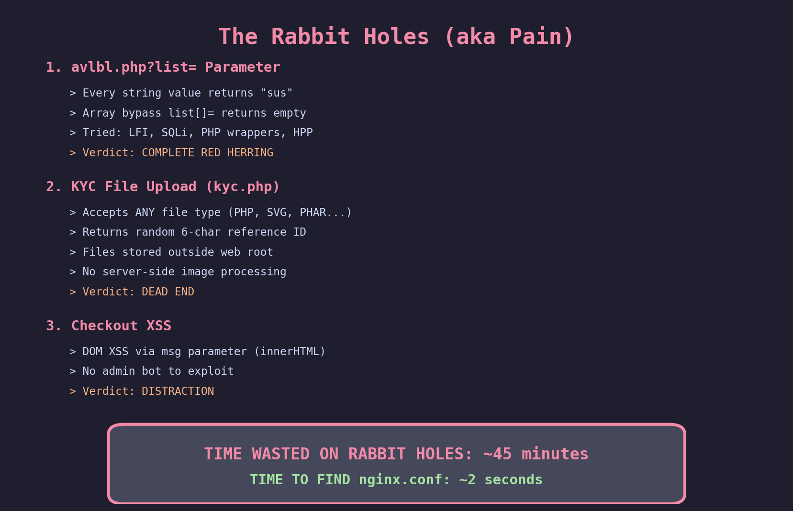
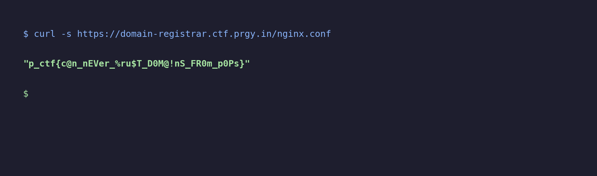
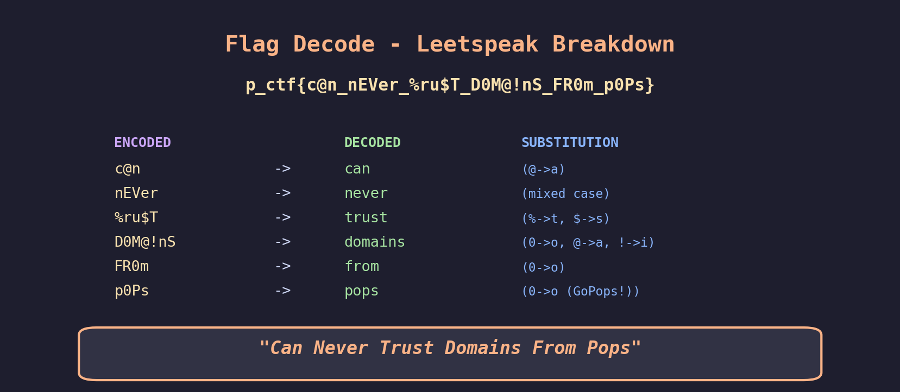
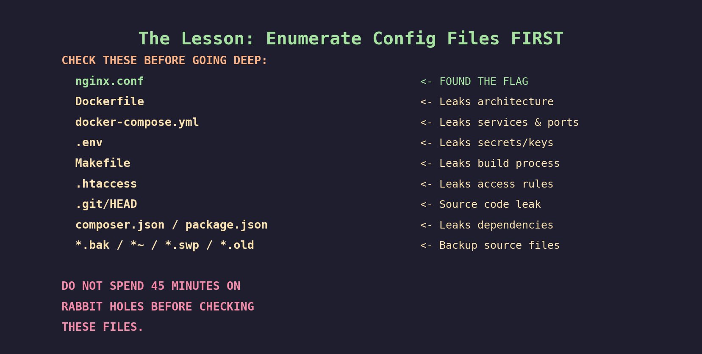
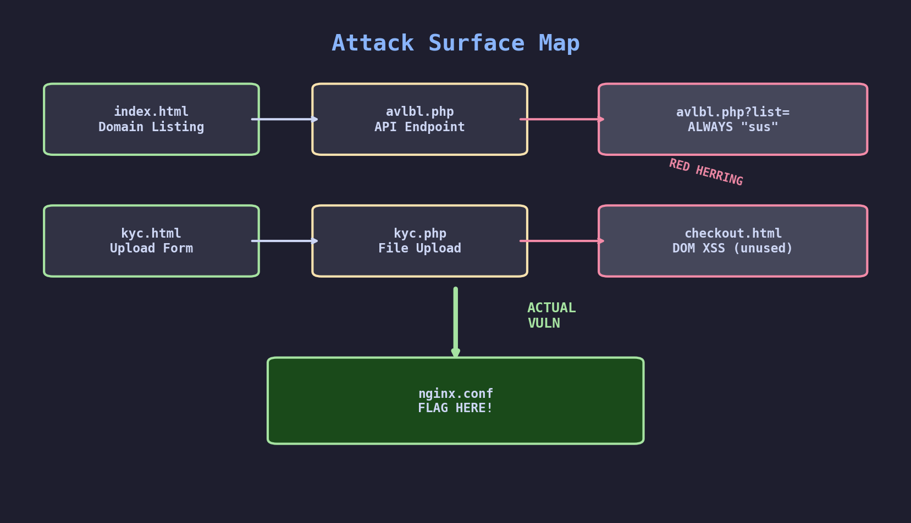

# Domain Registrar - Pragyan CTF Web Writeup

**Category:** Web Exploitation
**Difficulty:** Hard
**Points:** 486
**Solves:** 12
**Flag:** `p_ctf{c@n_nEVer_%ru$T_D0M@!nS_FR0m_p0Ps}`
**Solved by:** Smothy @ **0xN1umb** | **FIRST BLOOD**

---

> *"45 minutes chasing ghosts. 2 seconds to find the flag. Still got first blood. Built different."*
---

## Challenge Description



> This website looks like a good place to get a domain for my homelab, but this bloody KYC...

A domain registrar called **"GoPops Domains"** where you can browse and purchase joke domain names like `shatgpt.com`, `novidia.gpu`, and `chrome.ram`. The catch? You need to complete KYC (Know Your Customer) verification by uploading a photo ID before buying. Spoiler: the KYC was never the problem.

## TL;DR
The entire site - file uploads, "sus" parameter, KYC form - was bait. The flag was sitting in an exposed `nginx.conf` file in the web root. One `curl` command. First blood. Recon go brrr.

## FIRST BLOOD



**0xN1umb** - February 6th, 7:40:19 AM. 16 minutes before second place. Let's gooo.


## Initial Recon

First things first - hit the site and map everything out.

The site is a PHP 8.2.30 app running behind nginx. Clean, simple domain registrar with joke domain names for sale:



Domains like `shatgpt.com`, `novidia.gpu`, `chrome.ram`, `banana.mephone` - the devs had fun with this one.

The site structure:

```
index.html      -> Domain listing page
avlbl.php       -> API (action=get_domains returns JSON)
kyc.php         -> POST file upload for KYC verification
kyc.html        -> Upload form (name + photo ID)
checkout.html   -> Order status page
app.js          -> Client-side JavaScript
```

The JS source revealed a suspicious commented-out line - a breadcrumb that sent me straight into a rabbit hole:

```javascript
// const ep = "avlbl.php?list=
```

An incomplete URL string pointing to a `list` parameter on the API endpoint. Looked like a developer left behind a debug endpoint. Juicy. Or so I thought...

## Step 1: The "sus" Wall (Red Herring #1)

The `avlbl.php` endpoint has a `list` parameter. Let's see what it does.



```bash
$ curl "avlbl.php?list=test"       -> sus
$ curl "avlbl.php?list=a"          -> sus
$ curl "avlbl.php?list=."          -> sus
$ curl "avlbl.php?list=/"          -> sus
$ curl "avlbl.php?list=Available"  -> sus
```

**Every. Single. Input.** Returns `sus`. Even a single character. I threw the kitchen sink at it:

- LFI payloads (`../../../etc/passwd`)
- PHP wrappers (`php://filter/convert.base64-encode/resource=avlbl.php`)
- SQL injection (`' OR 1=1--`)
- HTTP Parameter Pollution (multiple `list` params)
- Array bypass (`list[]=test`) - returns empty instead of "sus" but still useless
- URL encoding, double encoding, null bytes, Unicode
- POST body, cookies, custom headers

Nothing. The parameter blocks every string value. It's either a honeypot or the filter is literally `if (isset($_GET['list'])) { echo "sus"; }`.


## Step 2: KYC File Upload (Red Herring #2)

The challenge description literally says "this bloody KYC" - so naturally I went ALL in on the file upload.

The KYC form asks for a name and a photo ID:



```bash
$ curl -F 'fullname=test' -F 'kyc_photo=@shell.php' kyc.php
{"status":"success","message":"...Reference ID: XNPWAS"}

$ curl -F 'fullname=test' -F 'kyc_photo=@exploit.phar' kyc.php
{"status":"success","message":"...Reference ID: 9B75HX"}

$ curl -F 'fullname=test' -F 'kyc_photo=@xxe.svg' kyc.php
{"status":"success","message":"...Reference ID: E6P465"}
```

The server accepts **literally any file type** - PHP webshells, SVG XXE, PHAR archives - you name it. Returns a random 6-char reference ID each time. But the files are stored somewhere completely inaccessible from the web:

- Tried every upload directory name imaginable (`uploads/`, `kyc/`, `files/`, `data/`, `tmp/`)
- Reference ID as filename with every extension
- Path traversal in the upload filename (`../../../var/www/html/shell.php`)
- Created webhook callbacks to detect server-side image processing - **zero callbacks**

No server-side processing. No accessible upload directory. Pure misdirection.

## Step 3: Other Dead Ends

For the homies who want the full pain log:

- **Checkout XSS**: `checkout.html?msg=<script>alert(1)</script>` - DOM XSS exists via `innerHTML` but no admin bot to exploit it against
- **SQLi on action parameter**: sqlmap ran for 30 minutes against every parameter. Zero injections found
- **SSTI in fullname**: `{{7*7}}` in the name field - nope
- **Timing-based blind SQLi**: All responses ~400ms regardless of payload. No SLEEP() delay
- **ffuf directory scan**: Scanned with raft-small-words wordlist. Found nothing useful
- **Subdomain enumeration**: `api.` and `admin.` subdomains don't resolve
- **Backup files**: `.bak`, `.swp`, `.old` - checked them all for PHP source leak

## Step 4: The Breakthrough - Config File Enumeration

After exhausting all the "interesting" attack vectors, I finally did what I should have done in the FIRST 30 SECONDS - **enumerate common config files**.


```bash
$ curl https://domain-registrar.ctf.prgy.in/nginx.conf
```



Are you kidding me. **THE FLAG WAS IN AN EXPOSED NGINX CONFIG FILE.**

The nginx configuration file was sitting right there in the web root, accessible to anyone who asked. No auth. No filter. No tricks. Just... there. Waiting.


## The Flag

```
p_ctf{c@n_nEVer_%ru$T_D0M@!nS_FR0m_p0Ps}
```



Leetspeak breakdown:

| Encoded | Decoded | Substitution |
|---------|---------|--------------|
| `c@n` | can | @->a |
| `nEVer` | never | mixed case |
| `%ru$T` | trust | %->t, $->s |
| `D0M@!nS` | domains | 0->o, @->a, !->i |
| `FR0m` | from | 0->o |
| `p0Ps` | pops | 0->o |

> **"Can Never Trust Domains From Pops"** - a reference to the "GoPops Domains" site name. Respect to the challenge author for that one.

## The Solve Script

```bash
#!/bin/bash
# Domain Registrar solve - Pragyan CTF 2026
# Smothy @ 0xN1umb - FIRST BLOOD
# The entire solve in one line. Pain.

curl -s https://domain-registrar.ctf.prgy.in/nginx.conf
# Output: "p_ctf{c@n_nEVer_%ru$T_D0M@!nS_FR0m_p0Ps}"
```

Yeah. That's it. One curl command. 486 points.

## The Graveyard of Failed Attempts


1. **LFI via `list` parameter** - 15 minutes of trying every wrapper, encoding, and bypass known to humanity. Every input returns "sus". Lesson: if it blocks EVERYTHING, it's probably a trap.

2. **File upload to web shell** - 15 minutes uploading PHP shells, SVG XXE, PHAR archives, ImageMagick exploits. The server eats everything and stores it in the void.

3. **SSRF via uploaded images** - Created SVG/image files with webhook.site callbacks. Zero callbacks received. Server doesn't process uploads at all.

4. **Array parameter bypass** - Noticed `list[]` gives empty response instead of "sus". Spent 5 minutes thinking I found the bypass. Nope - arrays just silently fail.

5. **Race condition** - Tried to hit uploaded files before they get moved. There's nothing to race against.

6. **sqlmap** - Let it run for 30 minutes against every parameter. Zero injections found.

> Total time in rabbit holes: ~45 minutes
> Time to find actual flag: ~2 seconds
> Still got first blood: **yes.**

## Key Takeaways



1. **ALWAYS enumerate config files EARLY** - `nginx.conf`, `Dockerfile`, `docker-compose.yml`, `.env`, `Makefile`, `.htaccess`. This should be in your first 10 commands, not your last.

2. **If a parameter blocks ALL input, it's probably bait** - When even a single character `a` triggers a filter, stop wasting time and look elsewhere. Don't spend 15 minutes on it.

3. **No webhook callbacks = no server-side processing** - If your SSRF/XXE payloads don't phone home, the server isn't parsing your uploads. Move on.

4. **Challenge descriptions are misdirection** - "this bloody KYC" made me tunnel vision on the upload. The KYC was fine. The nginx config was the problem.

5. **Simple vulnerabilities exist at every point level** - 486 points doesn't mean you need a 0-day. Sometimes it's about what you DON'T check.

6. **Recon checklist > fancy exploits** - A systematic recon checklist that includes config file enumeration would have found this in under a minute.

## Attack Surface Map



The entire site was designed as misdirection. The `list` parameter, the file upload, the XSS on checkout - all rabbit holes. The real vulnerability was the simplest thing: an exposed server config file sitting in the web root.

## Tools Used

- `curl` - HTTP requests (the only tool that actually mattered)
- `ffuf` - Directory bruteforce (found nothing useful)
- `sqlmap` - SQL injection testing (found nothing)
- `webhook.site` - Callback testing for SSRF (confirmed no server-side processing)
- `python3` + `matplotlib` - Screenshot generation
- Way too much caffeine
- An alarming amount of stubbornness that still somehow paid off

---
*Writeup by **Smothy** from **0xN1umb** team.*
*One curl. One config file. 486 points. First blood. Never skip recon basics. GG.*

